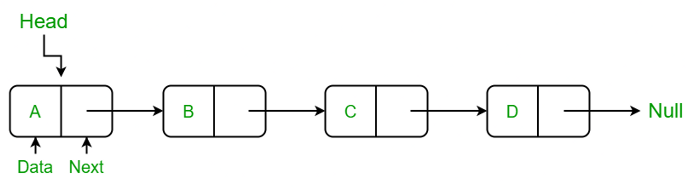

# Assignment-12 Questions & Solutions

💡 **Question-1:** Given a singly linked list, delete middle of the linked list. For example, if given linked list is 1->2->3->4->5 then linked list should be modified to 1->2->4->5.If there are even nodes, then there would be two middle nodes, we need to delete the second middle element. For example, if given linked list is 1->2->3->4->5->6 then it should be modified to 1->2->3->5->6.If the input linked list is NULL or has 1 node, then it should return NULL

Example 1:

```
Input:
LinkedList: 1->2->3->4->5
Output:1 2 4 5
```

Example 2:

```
Input:
LinkedList: 2->4->6->7->5->1
Output:2 4 6 5 1
```

💬 **Solution-1:**

```js
class Node {
    constructor(data) {
        this.data = data;
        this.next = null;
    }
}

class LinkedList {
    constructor() {
        this.head = null;
    }

    deleteMiddle() {
        if (this.head === null || this.head.next === null) {
            // If the list is empty or has only one node, return null
            this.head = null;
            return;
        }

        let slow_ptr = this.head;
        let fast_ptr = this.head;
        let prev = null;

        while (fast_ptr && fast_ptr.next) {
            fast_ptr = fast_ptr.next.next;
            prev = slow_ptr;
            slow_ptr = slow_ptr.next;
        }

        // Delete the middle node(s)
        prev.next = slow_ptr.next;
        return this.head;
    }

    insert(data) {
        const newNode = new Node(data);

        if (this.head === null) {
            this.head = newNode;
        } else {
            let current = this.head;
            while (current.next) {
                current = current.next;
            }
            current.next = newNode;
        }
    }

    display() {
        let current = this.head;
        while (current) {
            console.log(current.data);
            current = current.next;
        }
    }
}

// Example 1
const linkedList1 = new LinkedList();
linkedList1.insert(1);
linkedList1.insert(2);
linkedList1.insert(3);
linkedList1.insert(4);
linkedList1.insert(5);

console.log('Input:');
linkedList1.display(); // LinkedList: 1->2->3->4->5

linkedList1.deleteMiddle();

console.log('Output:');
linkedList1.display(); // Output:1 2 4 5

// Example 2
const linkedList2 = new LinkedList();
linkedList2.insert(2);
linkedList2.insert(4);
linkedList2.insert(6);
linkedList2.insert(7);
linkedList2.insert(5);
linkedList2.insert(1);

console.log('Input:');
linkedList2.display(); // LinkedList: 2->4->6->7->5->1

linkedList2.deleteMiddle();

console.log('Output:');
linkedList2.display(); // Output:2 4 6 5 1

```

<hr/>

💡 **Question-2:** Given a linked list of **N** nodes. The task is to check if the linked list has a loop. Linked list can contain self loop.

Example:

```
Input:
N = 3
value[] = {1,3,4}
x(position at which tail is connected) = 2
Output:True
Explanation:In above test case N = 3.
The linked list with nodes N = 3 is
given. Then value of x=2 is given which
means last node is connected with xth
node of linked list. Therefore, there
exists a loop.
```

💬 **Solution-2:**

```js
class Node {
    constructor(data) {
        this.data = data;
        this.next = null;
    }
}

class LinkedList {
    constructor() {
        this.head = null;
    }

    detectLoop() {
        let slow_ptr = this.head;
        let fast_ptr = this.head;

        while (fast_ptr && fast_ptr.next) {
            slow_ptr = slow_ptr.next;
            fast_ptr = fast_ptr.next.next;

            if (slow_ptr === fast_ptr) {
                return true;
            }
        }
        return false;
    }

    insert(data) {
        const newNode = new Node(data);

        if (this.head === null) {
            this.head = newNode;
        } else {
            let current = this.head;
            while (current.next) {
                current = current.next;
            }
            current.next = newNode;
        }
    }
}

// Example:
const linkedList = new LinkedList();
linkedList.insert(1);
linkedList.insert(3);
linkedList.insert(4);

// Creating a loop by connecting the tail to the second node
linkedList.head.next.next.next = linkedList.head.next;

console.log(linkedList.detectLoop()); // Output: true

```

<hr/>

💡 **Question-3:** Given a linked list consisting of **L** nodes and given a number **N**. The task is to find the **N**th node from the end of the linked list.

Example 1:

```
Input:
N = 2
LinkedList: 1->2->3->4->5->6->7->8->9
Output:8
Explanation:In the first example, there
are 9 nodes in linked list and we need
to find 2nd node from end. 2nd node
from end is 8.
```

Example 2:

```
Input:
N = 5
LinkedList: 10->5->100->5
Output:-1
Explanation:In the second example, there
are 4 nodes in the linked list and we
need to find 5th from the end. Since 'n'
is more than the number of nodes in the
linked list, the output is -1.
```

💬 **Solution-3:**

```js
class Node {
    constructor(data) {
        this.data = data;
        this.next = null;
    }
}

class LinkedList {
    constructor() {
        this.head = null;
    }

    findNthFromEnd(n) {
        let main_ptr = this.head;
        let ref_ptr = this.head;

        for (let i = 0; i < n; i++) {
            if (ref_ptr === null) {
                return -1;
            }
            ref_ptr = ref_ptr.next;
        }

        while (ref_ptr !== null) {
            main_ptr = main_ptr.next;
            ref_ptr = ref_ptr.next;
        }
        return main_ptr.data;
    }

    insert(data) {
        const newNode = new Node(data);

        if (this.head === null) {
            this.head = newNode;
        } else {
            let current = this.head;
            while (current.next) {
                current = current.next;
            }
            current.next = newNode;
        }
    }
}

// Example 1:
const linkedList1 = new LinkedList();
linkedList1.insert(1);
linkedList1.insert(2);
linkedList1.insert(3);
linkedList1.insert(4);
linkedList1.insert(5);
linkedList1.insert(6);
linkedList1.insert(7);
linkedList1.insert(8);
linkedList1.insert(9);

console.log(linkedList1.findNthFromEnd(2)); // Output: 8

// Example 2:
const linkedList2 = new LinkedList();
linkedList2.insert(10);
linkedList2.insert(5);
linkedList2.insert(100);
linkedList2.insert(5);

console.log(linkedList2.findNthFromEnd(5)); // Output: -1

```

<hr/>

💡 **Question-4:** Given a singly linked list of characters, write a function that returns true if the given list is a palindrome, else false.




Examples:

> Input: R->A->D->A->R->NULL
> 
> Output: Yes
> 
> Input: C->O->D->E->NULL
> 
> Output: No
>

💬 **Solution-4:**

```js
class Node {
    constructor(data) {
        this.data = data;
        this.next = null;
    }
}

class LinkedList {
    constructor() {
        this.head = null;
    }

    isPalindrome() {
        let current = this.head;
        let length = 0;
        const charArray = [];
        // Traverse the linked list and store the characters in an array
        while (current) {
            charArray[length] = current.data;
            length++;
            current = current.next;
        }

        let start = 0;
        let end = length - 1;
        // Compare characters at corresponding positions
        while (start < end) {
            if (charArray[start] !== charArray[end]) {
                return false;
            }
            start++;
            end--;
        }
        return true;
    }

    insert(data) {
        const newNode = new Node(data);

        if (this.head === null) {
            this.head = newNode;
        } else {
            let current = this.head;
            while (current.next) {
                current = current.next;
            }
            current.next = newNode;
        }
    }
}

// Example 1:
const linkedList1 = new LinkedList();
linkedList1.insert('R');
linkedList1.insert('A');
linkedList1.insert('D');
linkedList1.insert('A');
linkedList1.insert('R');

console.log(linkedList1.isPalindrome()); // Output: true

// Example 2:
const linkedList2 = new LinkedList();
linkedList2.insert('C');
linkedList2.insert('O');
linkedList2.insert('D');
linkedList2.insert('E');

console.log(linkedList2.isPalindrome()); // Output: false

```

<hr/>

💡 **Question-5:** Given a linked list of **N** nodes such that it may contain a loop.

A loop here means that the last node of the link list is connected to the node at position X(1-based index). If the link list does not have any loop, X=0.

Remove the loop from the linked list, if it is present, i.e. unlink the last node which is forming the loop.

Example 1:

```
Input:
N = 3
value[] = {1,3,4}
X = 2
Output:1
Explanation:The link list looks like
1 -> 3 -> 4
     ^    |
     |____|
A loop is present. If you remove it
successfully, the answer will be 1.

```

Example 2:

```
Input:
N = 4
value[] = {1,8,3,4}
X = 0
Output:1
Explanation:The Linked list does not
contains any loop.
```

Example 3:

```
Input:
N = 4
value[] = {1,2,3,4}
X = 1
Output:1
Explanation:The link list looks like
1 -> 2 -> 3 -> 4
^              |
|______________|
A loop is present.
If you remove it successfully,
the answer will be 1.
```

💬 **Solution-5:**

```js
class Node {
    constructor(data) {
        this.data = data;
        this.next = null;
    }
}

class LinkedList {
    constructor() {
        this.head = null;
    }

    detectAndRemoveLoop() {
        let slow_ptr = this.head;
        let fast_ptr = this.head;
        let loopExists = false;

        // Use Floyd's cycle-finding algorithm to detect the loop
        while (slow_ptr && fast_ptr && fast_ptr.next) {
            slow_ptr = slow_ptr.next;
            fast_ptr = fast_ptr.next.next;

            if (slow_ptr === fast_ptr) {
                loopExists = true;
                break;
            }
        }

        if (loopExists) {
            slow_ptr = this.head;
            while (slow_ptr.next !== fast_ptr.next) {
                slow_ptr = slow_ptr.next;
                fast_ptr = fast_ptr.next;
            }
            fast_ptr.next = null;
        }
    }

    insert(data) {
        const newNode = new Node(data);

        if (this.head === null) {
            this.head = newNode;
        } else {
            let current = this.head;
            while (current.next) {
                current = current.next;
            }
            current.next = newNode;
        }
    }
}

// Example 1:
const linkedList1 = new LinkedList();
linkedList1.insert(1);
linkedList1.insert(3);
linkedList1.insert(4);

// Creating a loop by connecting the last node to the second node
linkedList1.head.next.next.next = linkedList1.head.next;

linkedList1.detectAndRemoveLoop();

console.log(linkedList1.head.data); // Output: 1

// Example 2:
const linkedList2 = new LinkedList();
linkedList2.insert(1);
linkedList2.insert(8);
linkedList2.insert(3);
linkedList2.insert(4);

linkedList2.detectAndRemoveLoop();

console.log(linkedList2.head.data); // Output: 1

// Example 3:
const linkedList3 = new LinkedList();
linkedList3.insert(1);
linkedList3.insert(2);
linkedList3.insert(3);
linkedList3.insert(4);

linkedList3.head.next.next.next.next = linkedList3.head;

linkedList3.detectAndRemoveLoop();

console.log(linkedList3.head.data); // Output: 1

```

<hr/>

💡 **Question-6:** Given a linked list and two integers M and N. Traverse the linked list such that you retain M nodes then delete next N nodes, continue the same till end of the linked list.

Examples:

```
Input:
M = 2, N = 2
Linked List: 1->2->3->4->5->6->7->8
Output:
Linked List: 1->2->5->6

Input:
M = 3, N = 2
Linked List: 1->2->3->4->5->6->7->8->9->10
Output:
Linked List: 1->2->3->6->7->8

Input:
M = 1, N = 1
Linked List: 1->2->3->4->5->6->7->8->9->10
Output:
Linked List: 1->3->5->7->9
```

💬 **Solution-6:**

```js
class Node {
    constructor(data) {
        this.data = data;
        this.next = null;
    }
}

class LinkedList {
    constructor() {
        this.head = null;
    }

    retainAndDelete(M, N) {
        let current = this.head;
        let count;

        // Traverse the linked list
        while (current) {
            // Retain M nodes
            for (count = 1; count < M && current; count++) {
                current = current.next;
            }

            if (!current) {
                break;
            }
            // Delete N nodes
            let nextNode = current.next;
            for (count = 1; count <= N && nextNode; count++) {
                let temp = nextNode;
                nextNode = nextNode.next;
                temp = null;
            }
            // Connect the previous node to the next node after the deleted nodes
            current.next = nextNode;
            current = nextNode;
        }
    }

    insert(data) {
        const newNode = new Node(data);

        if (this.head === null) {
            this.head = newNode;
        } else {
            let current = this.head;
            while (current.next) {
                current = current.next;
            }
            current.next = newNode;
        }
    }

    printList() {
        let current = this.head;
        let result = '';
        while (current) {
            result += current.data + ' ';
            current = current.next;
        }
        console.log(result.trim());
    }
}

// Example 1:
const linkedList1 = new LinkedList();
linkedList1.insert(1);
linkedList1.insert(2);
linkedList1.insert(3);
linkedList1.insert(4);
linkedList1.insert(5);
linkedList1.insert(6);
linkedList1.insert(7);
linkedList1.insert(8);

linkedList1.retainAndDelete(2, 2);
linkedList1.printList(); // Output: 1 2 5 6

// Example 2:
const linkedList2 = new LinkedList();
linkedList2.insert(1);
linkedList2.insert(2);
linkedList2.insert(3);
linkedList2.insert(4);
linkedList2.insert(5);
linkedList2.insert(6);
linkedList2.insert(7);
linkedList2.insert(8);
linkedList2.insert(9);
linkedList2.insert(10);

linkedList2.retainAndDelete(3, 2);
linkedList2.printList(); // Output: 1 2 3 6 7 8

// Example 3:
const linkedList3 = new LinkedList();
linkedList3.insert(1);
linkedList3.insert(2);
linkedList3.insert(3);
linkedList3.insert(4);
linkedList3.insert(5);
linkedList3.insert(6);
linkedList3.insert(7);
linkedList3.insert(8);
linkedList3.insert(9);
linkedList3.insert(10);

linkedList3.retainAndDelete(1, 1);
linkedList3.printList(); // Output: 1 3 5 7 9

```

<hr/>

💡 **Question-7:** Given two linked lists, insert nodes of second list into first list at alternate positions of first list.
For example, if first list is 5->7->17->13->11 and second is 12->10->2->4->6, the first list should become 5->12->7->10->17->2->13->4->11->6 and second list should become empty. The nodes of second list should only be inserted when there are positions available. For example, if the first list is 1->2->3 and second list is 4->5->6->7->8, then first list should become 1->4->2->5->3->6 and second list to 7->8.

Use of extra space is not allowed (Not allowed to create additional nodes), i.e., insertion must be done in-place. Expected time complexity is O(n) where n is number of nodes in first list.

💬 **Solution-7:**

```js
class Node {
    constructor(data) {
        this.data = data;
        this.next = null;
    }
}

class LinkedList {
    constructor() {
        this.head = null;
    }

    insertAtAlternatePositions(secondList) {
        let firstPtr = this.head;
        let secondPtr = secondList.head;

        while (secondPtr) {
            let nextNode = secondPtr.next;
            secondPtr.next = firstPtr.next;
            firstPtr.next = secondPtr;
            firstPtr = firstPtr.next.next;
            secondPtr = nextNode;
            // Breaking the loop if there are no more nodes in the first list
            if (!firstPtr) {
                break;
            }
        }
        secondList.head = null;
    }

    insert(data) {
        const newNode = new Node(data);

        if (this.head === null) {
            this.head = newNode;
        } else {
            let current = this.head;
            while (current.next) {
                current = current.next;
            }
            current.next = newNode;
        }
    }

    printList() {
        let current = this.head;
        let result = '';
        while (current) {
            result += current.data + ' ';
            current = current.next;
        }
        console.log(result.trim());
    }
}

// Example:
const firstList = new LinkedList();
firstList.insert(5);
firstList.insert(7);
firstList.insert(17);
firstList.insert(13);
firstList.insert(11);

const secondList = new LinkedList();
secondList.insert(12);
secondList.insert(10);
secondList.insert(2);
secondList.insert(4);
secondList.insert(6);

firstList.insertAtAlternatePositions(secondList);
firstList.printList(); // Output: 5 12 7 10 17 2 13 4 11 6
secondList.printList(); // Output: (empty)

```

<hr/>

💡 **Question-8:** Given a singly linked list, find if the linked list is [circular](https://www.geeksforgeeks.org/circular-linked-list/amp/) or not.

> A linked list is called circular if it is not NULL-terminated and all nodes are connected in the form of a cycle. Below is an example of a circular linked list.


💬 **Solution-8:**

```js
class Node {
    constructor(data) {
        this.data = data;
        this.next = null;
    }
}

class LinkedList {
    constructor() {
        this.head = null;
    }

    isCircular() {
        if (!this.head) {
            return false;
        }

        let slow = this.head;
        let fast = this.head;

        while (fast && fast.next) {
            slow = slow.next;
            fast = fast.next.next;

            if (slow === fast) {
                return true;
            }
        }
        return false;
    }

    insert(data) {
        const newNode = new Node(data);

        if (this.head === null) {
            this.head = newNode;
        } else {
            let current = this.head;
            while (current.next) {
                current = current.next;
            }
            current.next = newNode;
        }
    }
}

// Example:
const linkedList = new LinkedList();
const node1 = new Node(1);
const node2 = new Node(2);
const node3 = new Node(3);
const node4 = new Node(4);
const node5 = new Node(5);

linkedList.head = node1;
node1.next = node2;
node2.next = node3;
node3.next = node4;
node4.next = node5;

console.log(linkedList.isCircular()); // Output: false

// Create a cycle
node5.next = node2;

console.log(linkedList.isCircular()); // Output: true

```

<hr/>