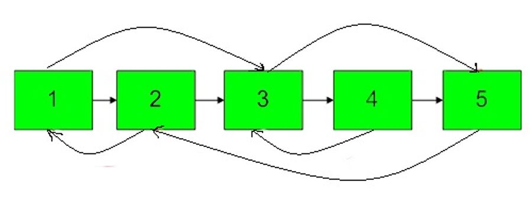
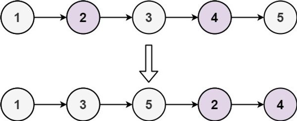
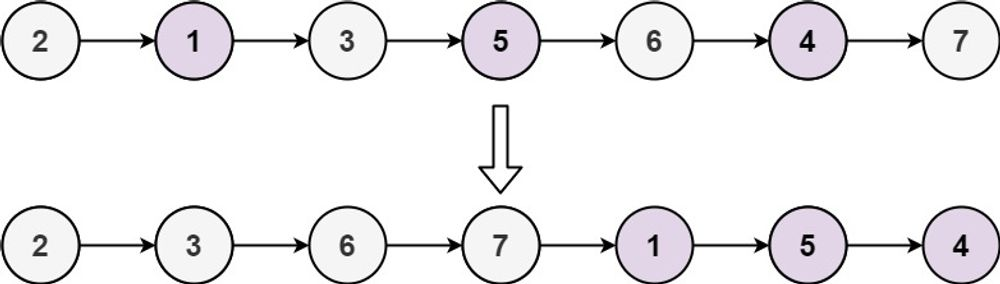
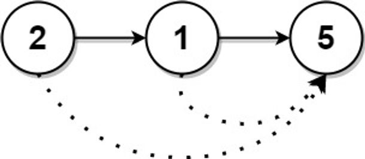
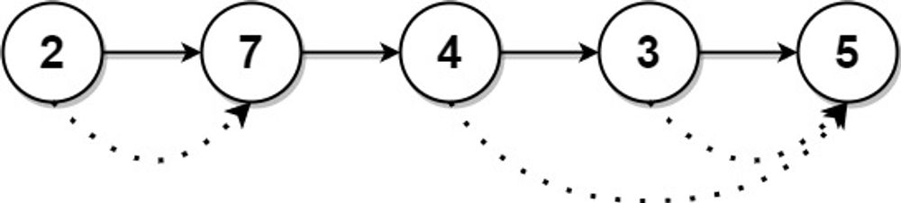

# Assignment-14 Questions & Solutions

💡 **Question-1:** Given a linked list of **N** nodes such that it may contain a loop.

A loop here means that the last node of the link list is connected to the node at position X(1-based index). If the link list does not have any loop, X=0.

Remove the loop from the linked list, if it is present, i.e. unlink the last node which is forming the loop.

Example 1:

```
Input:
N = 3
value[] = {1,3,4}
X = 2
Output:1
Explanation:The link list looks like
1 -> 3 -> 4
     ^    |
     |____|
A loop is present. If you remove it
successfully, the answer will be 1.
```

Example 2:

```
Input:
N = 4
value[] = {1,8,3,4}
X = 0
Output:1
Explanation:The Linked list does not
contains any loop.
```

Example 3:

```
Input:
N = 4
value[] = {1,2,3,4}
X = 1
Output:1
Explanation:The link list looks like
1 -> 2 -> 3 -> 4
^              |
|______________|
A loop is present.
If you remove it successfully,
the answer will be 1.
```

💬 **Solution-1:**

```js
class Node {
  constructor(value) {
    this.value = value;
    this.next = null;
  }
}

// to remove the loop from a linked list
function removeLoop(head) {
  let slow = head;
  let fast = head;

  // detect the loop using Floyd's Cycle-Finding Algorithm
  while (fast && fast.next) {
    slow = slow.next;
    fast = fast.next.next;
    if (slow === fast) {
      break;
    }
  }

  // If there is no loop, return the original linked list
  if (!fast || !fast.next) {
    return head;
  }
  slow = head;
  while (slow.next !== fast.next) {
    slow = slow.next;
    fast = fast.next;
  }

  // unlink the last node to remove the loop
  fast.next = null;
  return head;
}

// to create a linked list from an array of values
function createLinkedList(arr) {
  if (!arr || arr.length === 0) {
    return null;
  }

  const head = new Node(arr[0]);
  let current = head;

  for (let i = 1; i < arr.length; i++) {
    const newNode = new Node(arr[i]);
    current.next = newNode;
    current = newNode;
  }

  return head;
}

// to print the linked list
function printLinkedList(head) {
  let current = head;
  const values = [];

  while (current) {
    values.push(current.value);
    current = current.next;
  }

  console.log(values.join(" -> "));
}

// Example:
const N = 3;
const values = [1, 3, 4];
const X = 2;

const head = createLinkedList(values);

// Create a loop if X is not zero
if (X !== 0) {
  let loopNode = head;
  for (let i = 1; i < X; i++) {
    loopNode = loopNode.next;
  }
  let tail = head;
  while (tail.next) {
    tail = tail.next;
  }
  tail.next = loopNode;
}

console.log("Original linked list:");
printLinkedList(head);

// Remove the loop
const modifiedHead = removeLoop(head);

console.log("Modified linked list:");
printLinkedList(modifiedHead);

```

<hr/>

💡 **Question-2:** A number **N** is represented in Linked List such that each digit corresponds to a node in linked list. You need to add 1 to it.

Examples:

```
Input:
LinkedList: 4->5->6
Output:457

Input:
LinkedList: 1->2->3
Output:124
```

💬 **Solution-2:** 

```js
// Definition of a linked list node
class Node {
  constructor(value) {
    this.value = value;
    this.next = null;
  }
}

// to reverse a linked list
function reverseLinkedList(head) {
  let prev = null;
  let current = head;
  let next = null;

  while (current) {
    next = current.next;
    current.next = prev;
    prev = current;
    current = next;
  }

  return prev;
}

// to add 1 to a linked list representing a number
function addOne(head) {
  // Reverse the linked list
  let reversedHead = reverseLinkedList(head);

  let current = reversedHead;
  let carry = 1; // Start with a carry of 1

  while (current) {
    let sum = current.value + carry;
    current.value = sum % 10;
    carry = Math.floor(sum / 10);

    if (carry === 0) {
      break;
    }
    current = current.next;
  }

  if (carry !== 0) {
    let newHead = new Node(carry);
    newHead.next = reversedHead;
    reversedHead = newHead;
  }
  return reverseLinkedList(reversedHead);
}

// to create a linked list from an array of values
function createLinkedList(arr) {
  if (!arr || arr.length === 0) {
    return null;
  }
  const head = new Node(arr[0]);
  let current = head;

  for (let i = 1; i < arr.length; i++) {
    const newNode = new Node(arr[i]);
    current.next = newNode;
    current = newNode;
  }
  return head;
}

// to convert a linked list to a number
function linkedListToNumber(head) {
  let current = head;
  let number = 0;

  while (current) {
    number = number * 10 + current.value;
    current = current.next;
  }
  return number;
}

// to convert a number to a linked list
function numberToLinkedList(number) {
  const digits = [];
  while (number > 0) {
    digits.push(number % 10);
    number = Math.floor(number / 10);
  }
  return createLinkedList(digits.reverse());
}

// Example:
const values = [4, 5, 6];
const head = createLinkedList(values);

console.log("Original linked list:");
console.log(values.join(" -> "));

const modifiedHead = addOne(head);

console.log("Modified linked list:");
console.log(linkedListToNumber(modifiedHead));

```

<hr/>

💡 **Question-3:** Given a Linked List of size N, where every node represents a sub-linked-list and contains two pointers:(i) a next pointer to the next node,(ii) a bottom pointer to a linked list where this node is head.Each of the sub-linked-list is in sorted order.Flatten the Link List such that all the nodes appear in a single level while maintaining the sorted order. **Note:** The flattened list will be printed using the bottom pointer instead of next pointer.

Example 1:

```
Input:
5 -> 10 -> 19 -> 28
|     |     |     |
7     20    22   35
|           |     |
8          50    40
|                 |
30               45
Output: 5-> 7-> 8- > 10 -> 19-> 20->
22-> 28-> 30-> 35-> 40-> 45-> 50.
Explanation:
The resultant linked lists has every
node in a single level.(Note:| represents the bottom pointer.)
```

Example 2:

```
Input:
5 -> 10 -> 19 -> 28
|          |
7          22
|          |
8          50
|
30
Output: 5->7->8->10->19->22->28->30->50
Explanation:
The resultant linked lists has every
node in a single level.

(Note:| represents the bottom pointer.)
```

💬 **Solution-3:**

```js
// Definition of a linked list node
class Node {
  constructor(data) {
    this.data = data;
    this.next = null;
    this.bottom = null;
  }
}

// to merge two sorted linked lists
function mergeLists(list1, list2) {
  const dummyNode = new Node(0);
  let tail = dummyNode;

  // Merge the two lists in sorted order
  while (list1 && list2) {
    if (list1.data <= list2.data) {
      tail.bottom = list1;
      list1 = list1.bottom;
    } else {
      tail.bottom = list2;
      list2 = list2.bottom;
    }
    tail = tail.bottom;
  }

  if (list1) {
    tail.bottom = list1;
  }
  if (list2) {
    tail.bottom = list2;
  }
  return dummyNode.bottom;
}

// to flatten a linked list with sub-linked lists
function flattenLinkedList(head) {
  if (!head || !head.next) {
    // Base case: empty list or single node
    return head;
  }
  head.next = flattenLinkedList(head.next);
  head = mergeLists(head, head.next);
  return head;
}

// to create a linked list with sub-linked lists
function createLinkedList(arr) {
  const head = new Node(arr[0]);
  let current = head;

  for (let i = 1; i < arr.length; i++) {
    let subList = new Node(arr[i]);
    current.bottom = subList;
    current = current.bottom;
  }
  return head;
}

// to print the flattened linked list
function printFlattenedList(head) {
  let current = head;
  const values = [];
  while (current) {
    values.push(current.data);
    current = current.bottom;
  }
  console.log(values.join("->"));
}

// Example:
const values1 = [5, 10, 19, 28];
const sublist1 = [7, 20, 22, 35];
const sublist2 = [8, 50];
const sublist3 = [30, 45];

const head = createLinkedList(values1);
head.bottom = createLinkedList(sublist1);
head.bottom.bottom = createLinkedList(sublist2);
head.bottom.bottom.bottom = createLinkedList(sublist3);

console.log("Original linked list:");
printFlattenedList(head);

const flattenedHead = flattenLinkedList(head);

console.log("Flattened linked list:");
printFlattenedList(flattenedHead);

```

<hr/>

💡 **Question-4:** You are given a special linked list with **N** nodes where each node has a next pointer pointing to its next node. You are also given **M** random pointers, where you will be given **M** number of pairs denoting two nodes **a** and **b**  **i.e. a->arb = b** (arb is pointer to random node)**.**

Construct a copy of the given list. The copy should consist of exactly **N** new nodes, where each new node has its value set to the value of its corresponding original node. Both the next and random pointer of the new nodes should point to new nodes in the copied list such that the pointers in the original list and copied list represent the same list state. None of the pointers in the new list should point to nodes in the original list.

For example, if there are two nodes **X** and **Y** in the original list, where **X.arb** **-->** **Y**, then for the corresponding two nodes **x** and **y** in the copied list, **x.arb --> y.**

Return the head of the copied linked list.



Example 1:

```
Input:
N = 4, M = 2
value = {1,2,3,4}
pairs = {{1,2},{2,4}}
Output:1
Explanation:In this test case, there
are 4 nodes in linked list.  Among these
4 nodes,  2 nodes have arbitrary pointer
set, rest two nodes have arbitrary pointer
as NULL. Second line tells us the value
of four nodes. The third line gives the
information about arbitrary pointers.
The first node arbitrary pointer is set to
node 2.  The second node arbitrary pointer
is set to node 4.
```

Example 2:

```
Input:
N = 4, M = 2
value[] = {1,3,5,9}
pairs[] = {{1,1},{3,4}}
Output:1
Explanation:In the given testcase ,
applying the method as stated in the
above example, the output will be 1.
```

💬 **Solution-4:**

```js
class Node {
  constructor(data) {
    this.data = data;
    this.next = null;
    this.random = null;
  }
}

// to construct a copy of a special linked list
function copyRandomList(head) {
  if (!head) {
    return null;
  }

  // copy of each node and insert it between the original node and its next node
  let current = head;
  while (current) {
    const newNode = new Node(current.data);
    newNode.next = current.next;
    current.next = newNode;
    current = newNode.next;
  }

  // assign the random pointers of the copied nodes
  current = head;
  while (current) {
    if (current.random) {
      current.next.random = current.random.next;
    }
    current = current.next.next;
  }

  // separate the original and copied linked lists
  const newHead = head.next;
  current = head;
  let newCurrent = newHead;

  while (current) {
    current.next = current.next.next;
    if (newCurrent.next) {
      newCurrent.next = newCurrent.next.next;
    }
    current = current.next;
    newCurrent = newCurrent.next;
  }

  // restore the next pointers of the original linked list
  current = head;
  while (current && current.next) {
    const temp = current.next;
    current.next = temp.next;
    current = temp;
  }
  return newHead;
}

// to create a special linked list based on the given values and pairs
function createLinkedListWithRandomPointers(values, pairs) {
  const nodes = [];
  for (let i = 0; i < values.length; i++) {
    nodes[i] = new Node(values[i]);
  }

  for (let i = 0; i < pairs.length; i++) {
    const [sourceIndex, targetIndex] = pairs[i];
    nodes[sourceIndex - 1].random = nodes[targetIndex - 1];
  }

  for (let i = 0; i < nodes.length - 1; i++) {
    nodes[i].next = nodes[i + 1];
  }
  return nodes[0];
}

// to print the values and random pointers of a linked list
function printLinkedListWithRandomPointers(head) {
  let current = head;
  while (current) {
    const randomValue = current.random ? current.random.data : "NULL";
    console.log(`Value: ${current.data}, Random: ${randomValue}`);
    current = current.next;
  }
}

// Example:
const values = [1, 2, 3, 4];
const pairs = [[1, 2], [2, 4]];

const head = createLinkedListWithRandomPointers(values, pairs);

console.log("Original linked list with random pointers:");
printLinkedListWithRandomPointers(head);

const copiedHead = copyRandomList(head);

console.log("Copied linked list with random pointers:");
printLinkedListWithRandomPointers(copiedHead);

```

<hr/>

💡 **Question-5:** Given the `head` of a singly linked list, group all the nodes with odd indices together followed by the nodes with even indices, and return *the reordered list*.

The **first** node is considered **odd**, and the **second** node is **even**, and so on.

Note that the relative order inside both the even and odd groups should remain as it was in the input.

You must solve the problem in `O(1)` extra space complexity and `O(n)` time complexity.

Example 1:



```
Input: head = [1,2,3,4,5]
Output: [1,3,5,2,4]
```

Example 2:



```
Input: head = [2,1,3,5,6,4,7]
Output: [2,3,6,7,1,5,4]
```

💬 **Solution-5:**

```js
class ListNode {
  constructor(val) {
    this.val = val;
    this.next = null;
  }
}

// to group nodes with odd indices together followed by even indices
function oddEvenList(head) {
  if (!head || !head.next) {
    return head;
  }

  let oddHead = head;
  let evenHead = head.next;
  let odd = oddHead;
  let even = evenHead;

  while (even && even.next) {
    odd.next = even.next;
    odd = odd.next;
    even.next = odd.next;
    even = even.next;
  }
  odd.next = evenHead;
  return oddHead;
}

// to create a linked list from an array
function createLinkedList(arr) {
  const dummyHead = new ListNode(0);
  let current = dummyHead;

  for (let i = 0; i < arr.length; i++) {
    const newNode = new ListNode(arr[i]);
    current.next = newNode;
    current = current.next;
  }
  return dummyHead.next;
}

// to convert a linked list to an array
function linkedListToArray(head) {
  const arr = [];
  let current = head;

  while (current) {
    arr.push(current.val);
    current = current.next;
  }
  return arr;
}

// Example:
const head1 = createLinkedList([1, 2, 3, 4, 5]);
console.log("Original Linked List:");
console.log(linkedListToArray(head1));

const reorderedHead1 = oddEvenList(head1);
console.log("Reordered Linked List:");
console.log(linkedListToArray(reorderedHead1));

const head2 = createLinkedList([2, 1, 3, 5, 6, 4, 7]);
console.log("Original Linked List:");
console.log(linkedListToArray(head2));

const reorderedHead2 = oddEvenList(head2);
console.log("Reordered Linked List:");
console.log(linkedListToArray(reorderedHead2));

```

<hr/>

💡 **Question-6:** Given a singly linked list of size **N**. The task is to left-shift the linked list by **k** nodes, where **k** is a given positive integer smaller than or equal to length of the linked list.

Examples:

```
Input:
N = 5
value[] = {2, 4, 7, 8, 9}
k = 3
Output:8 9 2 4 7
Explanation:Rotate 1:4 -> 7 -> 8 -> 9 -> 2
Rotate 2: 7 -> 8 -> 9 -> 2 -> 4
Rotate 3: 8 -> 9 -> 2 -> 4 -> 7

Input:
N = 8
value[] = {1, 2, 3, 4, 5, 6, 7, 8}
k = 4
Output:5 6 7 8 1 2 3 4
```

💬 **Solution-6:**

```js
class ListNode {
  constructor(val) {
    this.val = val;
    this.next = null;
  }
}

// to left-shift a linked list by k nodes
function leftShiftLinkedList(head, k) {
  if (!head || !head.next || k === 0) {
    return head;
  }

  let length = 0;
  let current = head;
  let tail = null;

  while (current) {
    length++;
    tail = current;
    current = current.next;
  }
  k %= length;

  if (k === 0) {
    return head;
  }
  let newTail = null;
  current = head;

  // Traverse to the kth node from the beginning
  for (let i = 1; i < k; i++) {
    newTail = current;
    current = current.next;
  }

  const newHead = current;
  tail.next = head;
  newTail.next = null;
  return newHead;
}

// to create a linked list from an array
function createLinkedList(arr) {
  const dummyHead = new ListNode(0);
  let current = dummyHead;

  for (let i = 0; i < arr.length; i++) {
    const newNode = new ListNode(arr[i]);
    current.next = newNode;
    current = current.next;
  }
  return dummyHead.next;
}

// to convert a linked list to an array
function linkedListToArray(head) {
  const arr = [];
  let current = head;

  while (current) {
    arr.push(current.val);
    current = current.next;
  }
  return arr;
}

// Example:
const head1 = createLinkedList([2, 4, 7, 8, 9]);
const k1 = 3;
console.log("Original Linked List:");
console.log(linkedListToArray(head1));

const shiftedHead1 = leftShiftLinkedList(head1, k1);
console.log("Left-shifted Linked List:");
console.log(linkedListToArray(shiftedHead1));

const head2 = createLinkedList([1, 2, 3, 4, 5, 6, 7, 8]);
const k2 = 4;
console.log("Original Linked List:");
console.log(linkedListToArray(head2));

const shiftedHead2 = leftShiftLinkedList(head2, k2);
console.log("Left-shifted Linked List:");
console.log(linkedListToArray(shiftedHead2));

```

<hr/>

💡 **Question-7:** You are given the `head` of a linked list with `n` nodes.

For each node in the list, find the value of the next greater node. That is, for each node, find the value of the first node that is next to it and has a strictly larger value than it.

Return an integer array `answer` where `answer[i]` is the value of the next greater node of the `ith` node (1-indexed). If the `ith` node does not have a next greater node, set `answer[i] = 0`.

Example 1:



```
Input: head = [2,1,5]
Output: [5,5,0]
```

Example 2:



```
Input: head = [2,7,4,3,5]
Output: [7,0,5,5,0]
```

💬 **Solution-7:**

```js
// Definition of a linked list node
class ListNode {
  constructor(val) {
    this.val = val;
    this.next = null;
  }
}

// to find the next greater node for each node in the linked list
function nextLargerNodes(head) {
  const stack = [];
  const result = [];
  let current = reverseLinkedList(head);

  while (current) {
    while (stack.length > 0 && stack[stack.length - 1] <= current.val) {
      stack.pop();
    }

    if (stack.length === 0) {
      result.unshift(0);
    } else {
      result.unshift(stack[stack.length - 1]);
    }
    stack.push(current.val);
    current = current.next;
  }
  return result;
}

// to reverse a linked list
function reverseLinkedList(head) {
  let prev = null;
  let current = head;

  while (current) {
    const next = current.next;
    current.next = prev;
    prev = current;
    current = next;
  }
  return prev;
}

// to create a linked list from an array
function createLinkedList(arr) {
  const dummyHead = new ListNode(0);
  let current = dummyHead;

  for (let i = 0; i < arr.length; i++) {
    const newNode = new ListNode(arr[i]);
    current.next = newNode;
    current = current.next;
  }
  return dummyHead.next;
}

// Example:
const head1 = createLinkedList([2, 1, 5]);
console.log("Linked List:");
console.log(linkedListToArray(head1));

const result1 = nextLargerNodes(head1);
console.log("Next Greater Nodes:");
console.log(result1);

const head2 = createLinkedList([2, 7, 4, 3, 5]);
console.log("Linked List:");
console.log(linkedListToArray(head2));

const result2 = nextLargerNodes(head2);
console.log("Next Greater Nodes:");
console.log(result2);

```

<hr/>

💡 **Question-8:** Given the `head` of a linked list, we repeatedly delete consecutive sequences of nodes that sum to `0` until there are no such sequences.

After doing so, return the head of the final linked list.  You may return any such answer.

(Note that in the examples below, all sequences are serializations of `ListNode` objects.)

Examples:

```
Input: head = [1,2,-3,3,1]
Output: [3,1]
Note: The answer [1,2,1] would also be accepted.

Input: head = [1,2,3,-3,4]
Output: [1,2,4]

Input: head = [1,2,3,-3,-2]
Output: [1]
```

💬 **Solution-8:**

```js
class ListNode {
  constructor(val) {
    this.val = val;
    this.next = null;
  }
}

// to remove consecutive sequences of nodes that sum to 0
function removeZeroSumSublists(head) {
  const dummy = new ListNode(0);
  dummy.next = head;

  const stack = [];
  stack.push(dummy);

  let current = head;
  let sum = 0;

  while (current) {
    sum += current.val;

    if (sum === 0) {
      let prev = stack.pop();
      prev.next = current.next;
    } else {
      let found = false;

      // Check if there is a previous node with the same running sum
      for (let node = stack[stack.length - 1]; node !== dummy; node = node.next) {
        if (sum === node.val) {
          found = true;
          node.next = current.next;
          break;
        }
      }
      if (!found) {
        stack.push(current);
      }
    }
    current = current.next;
  }
  return dummy.next;
}

// to create a linked list from an array
function createLinkedList(arr) {
  const dummyHead = new ListNode(0);
  let current = dummyHead;

  for (let i = 0; i < arr.length; i++) {
    const newNode = new ListNode(arr[i]);
    current.next = newNode;
    current = current.next;
  }
  return dummyHead.next;
}

// to convert a linked list to an array
function linkedListToArray(head) {
  const arr = [];
  let current = head;

  while (current) {
    arr.push(current.val);
    current = current.next;
  }
  return arr;
}

// Example:
const head1 = createLinkedList([1, 2, -3, 3, 1]);
console.log("Linked List:");
console.log(linkedListToArray(head1));

const result1 = removeZeroSumSublists(head1);
console.log("Final Linked List:");
console.log(linkedListToArray(result1));

const head2 = createLinkedList([1, 2, 3, -3, 4]);
console.log("Linked List:");
console.log(linkedListToArray(head2));

const result2 = removeZeroSumSublists(head2);
console.log("Final Linked List:");
console.log(linkedListToArray(result2));

const head3 = createLinkedList([1, 2, 3, -3, -2]);
console.log("Linked List:");
console.log(linkedListToArray(head3));

const result3 = removeZeroSumSublists(head3);
console.log("Final Linked List:");
console.log(linkedListToArray(result3));

```

<hr/>