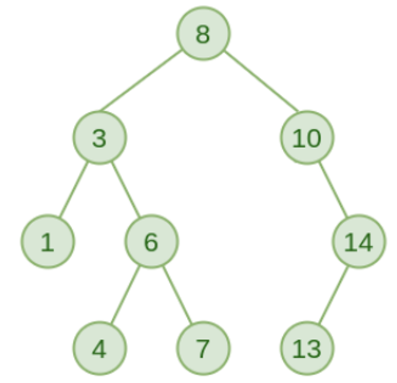

# Assignment-21 Questions & Solutions

💡 **Question-1:** You are given a binary tree. The binary tree is represented using the TreeNode class. Each TreeNode has an integer value and left and right children, represented using the TreeNode class itself. Convert this binary tree into a binary search tree.

Input:

        10

       /   \

      2      7

     /   \

    8      4

Output:

        8

      /   \

     4     10

    /   \

    2    7

💬 **Solution-1:**

```js
class TreeNode {
  constructor(value) {
    this.value = value;
    this.left = null;
    this.right = null;
  }
}

function binaryTreeToBST(root) {
  const nodeList = [];

  function inorderTraversal(node) {
    if (node === null) {
      return;
    }

    inorderTraversal(node.left);
    nodeList.push(node);
    inorderTraversal(node.right);
  }

  function convertToSortedArray() {
    const sortedArr = [];
    for (const node of nodeList) {
      sortedArr.push(node.value);
    }
    return sortedArr.sort((a, b) => a - b);
  }

  function updateNodeValues(node, sortedArr, index) {
    if (node === null) {
      return index;
    }

    index = updateNodeValues(node.left, sortedArr, index);
    node.value = sortedArr[index];
    index++;
    index = updateNodeValues(node.right, sortedArr, index);
    return index;
  }

  inorderTraversal(root);
  const sortedArr = convertToSortedArray();
  updateNodeValues(root, sortedArr, 0);

  return root;
}

// Example:
const root = new TreeNode(10);
root.left = new TreeNode(2);
root.right = new TreeNode(7);
root.left.left = new TreeNode(8);
root.left.right = new TreeNode(4);

const bstRoot = binaryTreeToBST(root);

// function to perform an inorder traversal of the BST (for verification)
function inorderTraversal(node) {
  if (node === null) {
    return;
  }

  inorderTraversal(node.left);
  console.log(node.value);
  inorderTraversal(node.right);
}

inorderTraversal(bstRoot);
```

<hr/>

💡 **Question-2:** Given a Binary Search Tree with all unique values and two keys. Find the distance between two nodes in BST. The given keys always exist in BST.

Example:

Consider the following BST:



Input-1:

n = 9

values = [8, 3, 1, 6, 4, 7, 10, 14,13]  node-1 = 6 node-2 = 14

Output-1: The distance between the two keys = 4

Input-2:

n = 9

values = [8, 3, 1, 6, 4, 7, 10, 14,13]  node-1 = 3  node-2 = 4

Output-2: The distance between the two keys = 2

💬 **Solution-2:**

```js
class TreeNode {
  constructor(value) {
    this.value = value;
    this.left = null;
    this.right = null;
  }
}

function findDistanceBetweenNodes(root, node1, node2) {
  function findLCA(node, value1, value2) {
    if (node === null) {
      return null;
    }

    if (node.value > value1 && node.value > value2) {
      return findLCA(node.left, value1, value2);
    }

    if (node.value < value1 && node.value < value2) {
      return findLCA(node.right, value1, value2);
    }
    return node;
  }

  function findDistanceFromNode(node, value) {
    if (node === null) {
      return 0;
    }

    if (node.value === value) {
      return 0;
    }

    if (node.value > value) {
      return 1 + findDistanceFromNode(node.left, value);
    }

    return 1 + findDistanceFromNode(node.right, value);
  }

  const lca = findLCA(root, node1, node2);

  const distance1 = findDistanceFromNode(lca, node1);
  const distance2 = findDistanceFromNode(lca, node2);

  return distance1 + distance2;
}

// creating the BST
const root = new TreeNode(8);
root.left = new TreeNode(3);
root.right = new TreeNode(10);
root.left.left = new TreeNode(1);
root.left.right = new TreeNode(6);
root.left.right.left = new TreeNode(4);
root.left.right.right = new TreeNode(7);
root.right.right = new TreeNode(14);
root.right.right.left = new TreeNode(13);

// Example 1:
const node1 = 6;
const node2 = 14;
console.log("The distance between the two keys =", findDistanceBetweenNodes(root, node1, node2)); // Output: 4

// Example 2:
const node3 = 3;
const node4 = 4;
console.log("The distance between the two keys =", findDistanceBetweenNodes(root, node3, node4)); // Output: 2
```

<hr/>

💡 **Question-3:** Write a program to convert a binary tree to a doubly linked list.

Input:

        10

       /   \

      5     20

           /   \

          30     35

Output: 5 10 30 20 35

💬 **Solution-3:**

```js
class TreeNode {
  constructor(value) {
    this.value = value;
    this.left = null;
    this.right = null;
  }
}

class DoublyLinkedListNode {
  constructor(value) {
    this.value = value;
    this.prev = null;
    this.next = null;
  }
}

function convertBinaryTreeToDLL(root) {
  function inorderTraversal(node) {
    if (node === null) {
      return null;
    }
    inorderTraversal(node.left);

    const newNode = new DoublyLinkedListNode(node.value);

    if (prevNode !== null) {
      prevNode.next = newNode;
      newNode.prev = prevNode;
    } else {
      head = newNode;
    }
    prevNode = newNode;
    inorderTraversal(node.right);
  }

  let head = null;
  let prevNode = null;

  inorderTraversal(root);
  return head;
}

// creating the binary tree
const root = new TreeNode(10);
root.left = new TreeNode(5);
root.right = new TreeNode(20);
root.right.left = new TreeNode(30);
root.right.right = new TreeNode(35);

const dllHead = convertBinaryTreeToDLL(root);

// traversing the doubly linked list
function traverseDLL(head) {
  let current = head;
  const result = [];
  while (current !== null) {
    result.push(current.value);
    current = current.next;
  }
  return result;
}

console.log(traverseDLL(dllHead)); // Output: [5, 10, 30, 20, 35]
```

<hr/>

💡 **Question-4:** Write a program to connect nodes at the same level.

Input:

         1

       /   \

      2      3

    /   \   /   \

    4    5 6     7

Output:

1 → -1

2 → 3

3 → -1

4 → 5

5 → 6

6 → 7

7 → -1

💬 **Solution-4:**

```js
class TreeNode {
  constructor(value) {
    this.value = value;
    this.left = null;
    this.right = null;
    this.next = null;
  }
}

function connectNodesAtSameLevel(root) {
  // Base case: if the root is null or a leaf node, return
  if (root === null || (root.left === null && root.right === null)) {
    return;
  }

  // assigning the next pointer of the left child to the right child
  if (root.left !== null) {
    root.left.next = root.right;
  }

  // assigning the next pointer of the right child to the next node of the root's next
  if (root.right !== null && root.next !== null) {
    root.right.next = root.next.left;
  }

  // recursively connecting the nodes in the left and right subtrees
  connectNodesAtSameLevel(root.left);
  connectNodesAtSameLevel(root.right);
}

// creating the binary tree
const root = new TreeNode(1);
root.left = new TreeNode(2);
root.right = new TreeNode(3);
root.left.left = new TreeNode(4);
root.left.right = new TreeNode(5);
root.right.left = new TreeNode(6);
root.right.right = new TreeNode(7);

// connecting the nodes at the same level
connectNodesAtSameLevel(root);

// traversing the connected nodes and print the connections
function traverseConnectedNodes(root) {
  let current = root;
  while (current !== null) {
    let node = current;
    let connectedNodes = [];
    while (node !== null) {
      connectedNodes.push(node.value);
      node = node.next;
    }
    connectedNodes.push(-1); // Mark the end of the level
    console.log(connectedNodes.join(" → "));
    current = current.left; // Move to the next level
  }
}

// printing the connections at each level
traverseConnectedNodes(root);

/* Output:
1 → -1
2 → 3
3 → -1
4 → 5
5 → 6
6 → 7
7 → -1
*/
```

<hr/>
