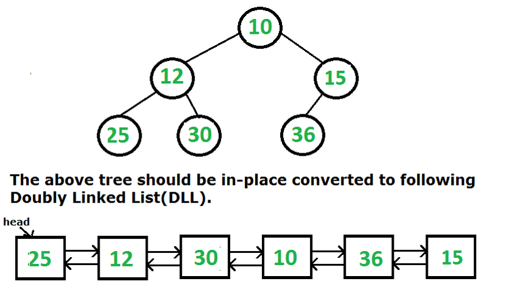
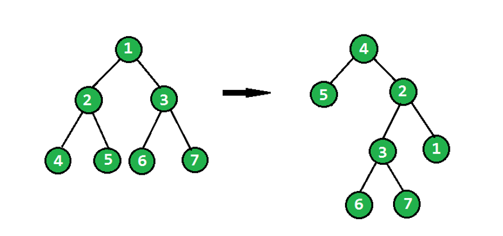
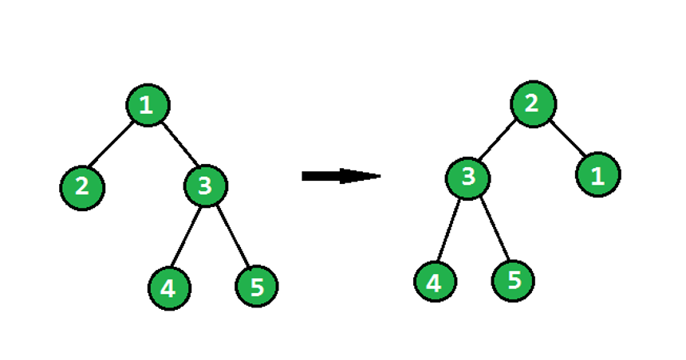

# Assignment-22 Questions & Solutions

💡 **Question-1:** Given a Binary Tree (Bt), convert it to a Doubly Linked List(DLL). The left and right pointers in nodes are to be used as previous and next pointers respectively in converted DLL. The order of nodes in DLL must be the same as in Inorder for the given Binary Tree. The first node of Inorder traversal (leftmost node in BT) must be the head node of the DLL.

Example:



💬 **Solution-1:**

```js
class TreeNode {
  constructor(value) {
    this.value = value;
    this.left = null;
    this.right = null;
  }
}

class DoublyLinkedListNode {
  constructor(value) {
    this.value = value;
    this.prev = null;
    this.next = null;
  }
}

function convertBinaryTreeToDLL(root) {
  let head = null;
  let prevNode = null; 

  function inorderTraversal(node) {
    if (node === null) {
      return;
    }
    inorderTraversal(node.left);

    const newNode = new DoublyLinkedListNode(node.value);

    if (prevNode !== null) {
      prevNode.next = newNode;
      newNode.prev = prevNode;
    } else {
      head = newNode;
    }
    prevNode = newNode;
    inorderTraversal(node.right);
  }
  inorderTraversal(root);
  return head;
}

// creating the binary tree
const root = new TreeNode(10);
root.left = new TreeNode(12);
root.right = new TreeNode(15);
root.left.left = new TreeNode(25);
root.left.right = new TreeNode(30);
root.right.left = new TreeNode(36);

const dllHead = convertBinaryTreeToDLL(root);

function traverseDLL(head) {
  let current = head;
  const result = [];
  while (current !== null) {
    result.push(current.value);
    current = current.next;
  }
  return result;
}

console.log(traverseDLL(dllHead)); // Output: [25, 12, 30, 10, 36, 15]
```

<hr/>

💡 **Question-2:** A Given a binary tree, the task is to flip the binary tree towards the right direction that is clockwise. See the below examples to see the transformation.

In the flip operation, the leftmost node becomes the root of the flipped tree and its parent becomes its right child and the right sibling becomes its left child and the same should be done for all left most nodes recursively.

Example 1:



Example 2:



💬 **Solution-2:**

```js
class TreeNode {
  constructor(value) {
    this.value = value;
    this.left = null;
    this.right = null;
  }
}

function flipBinaryTree(root) {
  if (root === null || (root.left === null && root.right === null)) {
    return root;
  }

  const flippedLeft = flipBinaryTree(root.left);
  const flippedRight = flipBinaryTree(root.right);

  root.left = null;
  root.right = null;
  if (flippedLeft !== null) {
    flippedLeft.right = root;
    root.left = flippedLeft;
  }
  return flippedRight;
}

// creating the binary tree
const root = new TreeNode(1);
root.left = new TreeNode(2);
root.right = new TreeNode(3);
root.left.left = new TreeNode(4);
root.left.right = new TreeNode(5);
root.right.left = new TreeNode(6);
root.right.right = new TreeNode(7);

// flip the binary tree in a clockwise direction
const flippedRoot = flipBinaryTree(root);

// function to print the flipped binary tree in a clockwise direction
function printFlippedTree(root) {
  if (root === null) {
    return;
  }

  let current = root;
  while (current !== null) {
    console.log(current.value);
    current = current.right;
  }
}

printFlippedTree(flippedRoot);
```

<hr/>

💡 **Question-3:** Given a binary tree, print all its root-to-leaf paths without using recursion. For example, consider the following Binary Tree.

Input:

         6
       /    \
      3      5
    /   \     \
    2     5     4
         /  \
        7    4

Output: There are 4 leaves, hence 4 root to leaf paths -

6->3->2

6->3->5->7

6->3->5->4

6->5>4

💬 **Solution-3:**

```js
class TreeNode {
  constructor(value) {
    this.value = value;
    this.left = null;
    this.right = null;
  }
}

function printRootToLeafPaths(root) {
  if (root === null) {
    return;
  }

  const stack = [];
  stack.push({ node: root, path: root.value.toString() });

  while (stack.length > 0) {
    const current = stack.pop();
    const currentNode = current.node;
    const currentPath = current.path;

    // if the current node is a leaf node, print the path
    if (currentNode.left === null && currentNode.right === null) {
      console.log(currentPath);
    }

    // traversing the left child, if it exists
    if (currentNode.left !== null) {
      stack.push({
        node: currentNode.left,
        path: currentPath + "->" + currentNode.left.value.toString(),
      });
    }

    // traversing the right child, if it exists
    if (currentNode.right !== null) {
      stack.push({
        node: currentNode.right,
        path: currentPath + "->" + currentNode.right.value.toString(),
      });
    }
  }
}

// creating the binary tree
const root = new TreeNode(6);
root.left = new TreeNode(3);
root.right = new TreeNode(5);
root.left.left = new TreeNode(2);
root.left.right = new TreeNode(5);
root.right.right = new TreeNode(4);
root.left.right.left = new TreeNode(7);
root.left.right.right = new TreeNode(4);

// printing all root-to-leaf paths
printRootToLeafPaths(root);

/* Output: 
6->3->2
6->3->5->7
6->3->5->4
6->5->4
*/
```

<hr/>

💡 **Question-4:** Given Preorder, Inorder and Postorder traversals of some tree. Write a program to check if they all are of the same tree.

**Examples:**

Input 1 :  Inorder -> 4 2 5 1 3 Preorder -> 1 2 4 5 3 Postorder -> 4 5 2 3 1
Output 1 :  Yes
Explanation : All of the above three traversals are of
the same tree 

        1
      /   \
     2     3
    /  \
    4   5

Input 2 :  Inorder -> 4 2 5 1 3  Preorder -> 1 5 4 2 3  Postorder -> 4 1 2 3 5
Output 2 : No

💬 **Solution-4:**

```js
function areTraversalsSame(inorder, preorder, postorder) {
  if (inorder.length === 0 && preorder.length === 0 && postorder.length === 0) {
    return true;
  }

  if (inorder.length !== preorder.length || inorder.length !== postorder.length) {
    return false;
  }

  if (inorder.length === 1 && preorder.length === 1 && postorder.length === 1) {
    return inorder[0] === preorder[0] && inorder[0] === postorder[0];
  }

  const root = preorder[0];
  const rootIndexInorder = inorder.indexOf(root);

  // spliting the traversals into left and right subtrees
  const leftInorder = inorder.slice(0, rootIndexInorder);
  const rightInorder = inorder.slice(rootIndexInorder + 1);

  const leftPreorder = preorder.slice(1, rootIndexInorder + 1);
  const rightPreorder = preorder.slice(rootIndexInorder + 1);

  const leftPostorder = postorder.slice(0, rootIndexInorder);
  const rightPostorder = postorder.slice(rootIndexInorder, -1);

  // recursively checking if the subtrees represent the same tree
  const areLeftTreesSame = areTraversalsSame(
    leftInorder,
    leftPreorder,
    leftPostorder
  );
  const areRightTreesSame = areTraversalsSame(
    rightInorder,
    rightPreorder,
    rightPostorder
  );
  return areLeftTreesSame && areRightTreesSame;
}

// Example 1:
const inorder1 = [4, 2, 5, 1, 3];
const preorder1 = [1, 2, 4, 5, 3];
const postorder1 = [4, 5, 2, 3, 1];

console.log(areTraversalsSame(inorder1, preorder1, postorder1)); // Output: true

// Example 2:
const inorder2 = [4, 2, 5, 1, 3];
const preorder2 = [1, 5, 4, 2, 3];
const postorder2 = [4, 1, 2, 3, 5];

console.log(areTraversalsSame(inorder2, preorder2, postorder2)); // Output: false
```

<hr/>
