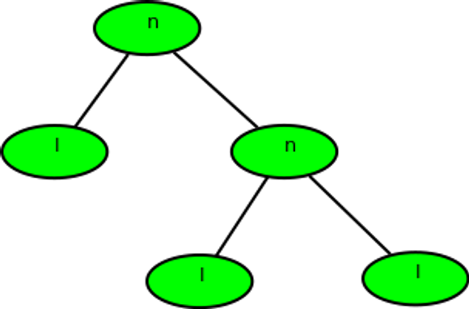
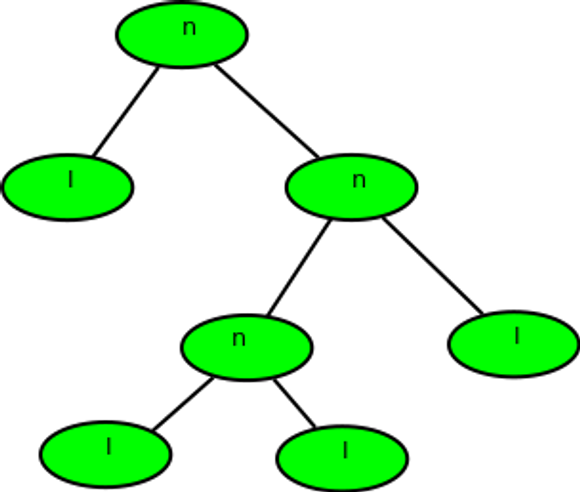
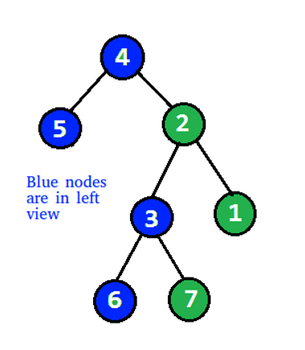

# Assignment-23 Questions & Solutions

💡 **Question-1:** Given preorder of a binary tree, calculate its **[depth(or height)](https://www.geeksforgeeks.org/write-a-c-program-to-find-the-maximum-depth-or-height-of-a-tree/)** [starting from depth 0]. The preorder is given as a string with two possible characters.

1. ‘l’ denotes the leaf
2. ‘n’ denotes internal node

The given tree can be seen as a full binary tree where every node has 0 or two children. The two children of a node can ‘n’ or ‘l’ or mix of both.

Examples :

Input 1: nlnll

Output 1: 2

Explanation :



Input 2: nlnnlll

Output 2: 3



💬 **Solution-1:**

```js
function calculateDepth(preorder) {
  let depth = 0;
  let stack = [];

  for (let i = 0; i < preorder.length; i++) {
    if (preorder[i] === 'n') {
      // internal node, incrementing depth and push it to the stack
      depth++;
      stack.push(depth);
    } else if (preorder[i] === 'l') {
      // leaf node, checking if it contributes to the maximum depth
      if (depth > 0 && depth > stack[stack.length - 1]) {
        stack[stack.length - 1] = depth;
      }
    } else {
      throw new Error('Invalid character in preorder traversal');
    }
  }
  return stack.pop();
}

// Example 1:
const preorder1 = 'nlnll';
console.log(calculateDepth(preorder1)); // Output: 2

// Example 2:
const preorder2 = 'nlnnlll';
console.log(calculateDepth(preorder2)); // Output: 3
```

<hr/>

💡 **Question-2:** Given a Binary tree, the task is to print the **left view** of the Binary Tree. The left view of a Binary Tree is a set of leftmost nodes for every level.

Examples:

Input 1:

            4

          /   \

        5     2

             /   \

            3     1

           /  \

          6    7

Output 1: 4 5 3 6

Explanation:



Input 2:

                    1

                  /   \

                2       3

                 \

                   4

                     \

                        5

                           \

                             6

Output 2: 1 2 4 5 6

💬 **Solution-2:**

```js
class TreeNode {
  constructor(val) {
    this.val = val;
    this.left = null;
    this.right = null;
  }
}

function printLeftView(root) {
  if (!root) {
    return;
  }
  let maxLevel = 0;

  function dfs(node, level) {
    if (!node) {
      return;
    }

    if (level > maxLevel) {
      console.log(node.val);
      maxLevel = level;
    }
    dfs(node.left, level + 1);
    dfs(node.right, level + 1);
  }
  dfs(root, 1);
}

// creating the BT
const root = new TreeNode(4);
root.left = new TreeNode(5);
root.right = new TreeNode(2);
root.right.left = new TreeNode(3);
root.right.right = new TreeNode(1);
root.right.left.left = new TreeNode(6);
root.right.left.right = new TreeNode(7);

// printing the left view
printLeftView(root);

/*
Input 1:           
       4
      /   \
    5       2
     / \
    3   1
     / \
     6   7


Output 1:
4
5
3
6

*/
```

<hr/>

💡 **Question-3:** Given a Binary Tree, print the Right view of it. The right view of a Binary Tree is a set of nodes visible when the tree is visited from the Right side.

Examples:

Input 1: 

          1

       /     \

      2         3

    /   \       /  \

    4     5    6     7

                \

                  8

Output 1:  Right view of the tree is 1 3 7 8

Input 2:

          1

         /

       8

     /

    7

Output 2: Right view of the tree is 1 8 7
 
💬 **Solution-3:**

```js
class TreeNode {
  constructor(val) {
    this.val = val;
    this.left = null;
    this.right = null;
  }
}

function printRightView(root) {
  if (!root) {
    return;
  }
  let maxLevel = 0;

  function dfs(node, level) {
    if (!node) {
      return;
    }

    if (level > maxLevel) {
      console.log(node.val);
      maxLevel = level;
    }
    dfs(node.right, level + 1);
    dfs(node.left, level + 1);
  }
  dfs(root, 1);
}

// creating the BT
const root = new TreeNode(1);
root.left = new TreeNode(2);
root.right = new TreeNode(3);
root.left.left = new TreeNode(4);
root.left.right = new TreeNode(5);
root.right.left = new TreeNode(6);
root.right.right = new TreeNode(7);
root.right.right.right = new TreeNode(8);

// printing the right view
printRightView(root);

/*
Input 1:
         1
      /    \
   2        3
 /   \    /   \
4     5  6     7
          \
           8


Output 1:
Right view of the tree is 1 3 7 8


Input 2:
         1
       /
    8
  /
7

Output 2:
Right view of the tree is 1 8 7

*/
```

<hr/>

💡 **Question-4:** Given a Binary Tree, The task is to print the **bottom view** from left to right. A node **x** is there in output if x is the bottommost node at its horizontal distance. The horizontal distance of the left child of a node x is equal to a horizontal distance of x minus 1, and that of a right child is the horizontal distance of x plus 1.

Examples:

Input 1:

             20

           /     \

        8         22

    /      \         \

    5         3        25

            /    \

          10       14

Output 1: 5, 10, 3, 14, 25.

Input 2:

             20

           /     \

        8         22

    /      \      /   \

    5         3    4     25

            /    \

          10       14

Output 2: 5 10 4 14 25.

Explanation: If there are multiple bottom-most nodes for a horizontal distance from the root, then print the later one in the level traversal.

**3 and 4** are both the bottom-most nodes at a horizontal distance of 0, we need to print 4.

💬 **Solution-4:**

```js
class TreeNode {
  constructor(val) {
    this.val = val;
    this.left = null;
    this.right = null;
  }
}

function printBottomView(root) {
  if (!root) {
    return;
  }

  let minHd = 0;
  let maxHd = 0;

  const map = new Map();
  const queue = [];

  map.set(0, root);

  while (queue.length > 0) {
    const { node, hd } = queue.shift();

    minHd = Math.min(minHd, hd);
    maxHd = Math.max(maxHd, hd);

    map.set(hd, node);
    if (node.left) {
      queue.push({ node: node.left, hd: hd - 1 });
    }
    if (node.right) {
      queue.push({ node: node.right, hd: hd + 1 });
    }
  }
  for (let i = minHd; i <= maxHd; i++) {
    console.log(map.get(i).val);
  }
}

// creating the BT
const root = new TreeNode(20);
root.left = new TreeNode(8);
root.right = new TreeNode(22);
root.left.left = new TreeNode(5);
root.left.right = new TreeNode(3);
root.right.right = new TreeNode(25);
root.left.right.left = new TreeNode(10);
root.left.right.right = new TreeNode(14);

// printing the bottom view
printBottomView(root);

/*
Input 1:
            20
          /   \
        8      22
     /    \      \
    5      3     25
          / \
        10   14


Output 1: 
5 10 3 14 25

Input 2:

            20
          /    \
        8       22
     /    \     /  \
    5      3   4    25
          / \
        10   14

Output 2:
5 10 4 14 25.

*/
```

<hr/>
