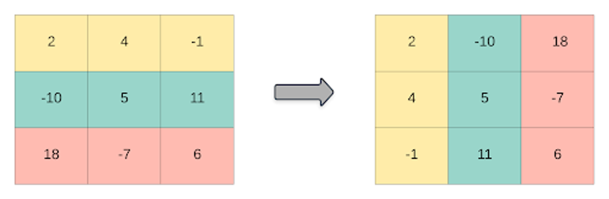
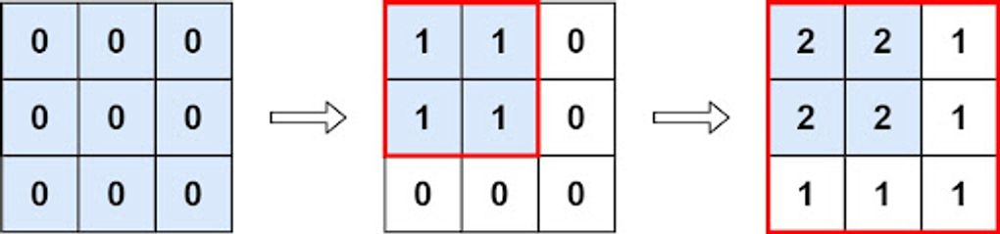

# Assignment-4 Questions & Solutions

💡 **Question-1:** Given three integer arrays arr1, arr2 and arr3 **sorted** in **strictly increasing** order, return a sorted array of **only** the integers that appeared in **all** three arrays.
Example: Input: arr1 = [1,2,3,4,5], arr2 = [1,2,5,7,9], arr3 = [1,3,4,5,8]
Output: [1,5]

💬 **Solution-1:**

```js
function findCommonElements(arr1, arr2, arr3) {
  let result = [];
  let i = 0, j = 0, k = 0;

  while (i < arr1.length && j < arr2.length && k < arr3.length) {
    if (arr1[i] === arr2[j] && arr2[j] === arr3[k]) {
      result.push(arr1[i]);
      i++;
      j++;
      k++;
    } else if (arr1[i] < arr2[j]) {
      i++;
    } else if (arr2[j] < arr3[k]) {
      j++;
    } else {
      k++;
    }
  }
  return result;
}

// Example:
const arr1 = [1, 2, 3, 4, 5];
const arr2 = [1, 2, 5, 7, 9];
const arr3 = [1, 3, 4, 5, 8];

const result = findCommonElements(arr1, arr2, arr3);
console.log(result); // Output: [1, 5]

```

<hr/>

💡 **Question-2:** Given two 0-indexed integer arrays nums1 and nums2, return a list answer of size 2 where:

- answer[0] is a list of all distinct integers in nums1 which are not present in nums2.
- answer[1] is a list of all distinct integers in nums2 which are not present in nums1.

Example:
Input: nums1 = [1,2,3], nums2 = [2,4,6]
Output:[[1,3],[4,6]]

💬 **Solution-2:**

```js
function findDisjointElements(nums1, nums2) {
  let distinctNums1 = [];
  let distinctNums2 = [];

  for (let num of nums1) {
    if (!nums2.includes(num) && !distinctNums1.includes(num)) {
      distinctNums1.push(num);
    }
  }

  for (let num of nums2) {
    if (!nums1.includes(num) && !distinctNums2.includes(num)) {
      distinctNums2.push(num);
    }
  }
  return [distinctNums1, distinctNums2];
}

// Example:
const nums1 = [1, 2, 3];
const nums2 = [2, 4, 6];

const result = findDisjointElements(nums1, nums2);
console.log(result); // Output: [[1, 3], [4, 6]]

```

<hr/>

💡 **Question-3:** Given a 2D integer array matrix, return the transpose of matrix.

Example: Input: matrix = [[1,2,3],[4,5,6],[7,8,9]] 
Output: [[1,4,7],[2,5,8],[3,6,9]]


💬 **Solution-3:**

```js
function transpose(matrix) {
  const rows = matrix.length;
  const cols = matrix[0].length;

  const transposedMatrix = [];
  for (let j = 0; j < cols; j++) {
    const row = [];
    for (let i = 0; i < rows; i++) {
      row.push(matrix[i][j]);
    }
    transposedMatrix.push(row);
  }
  return transposedMatrix;
}

// Example:
const matrix = [[1, 2, 3], [4, 5, 6], [7, 8, 9]];
const result = transpose(matrix);
console.log(result); // Output: [[1, 4, 7], [2, 5, 8], [3, 6, 9]]

```

<hr/>

💡 **Question-4:** Given an integer array nums of 2n integers, group these integers into n pairs (a1, b1), (a2, b2), ..., (an, bn) such that the sum of min(ai, bi) for all i is maximized. Return the maximized sum.

Example: Input: nums = [1,4,3,2] Output: 4

💬 **Solution-4:**

```js
function arrayPairSum(nums) {
  // Sort the array in ascending order
  nums.sort((a, b) => a - b);
  let sum = 0;
  for (let i = 0; i < nums.length; i += 2) {
    sum += nums[i];
  }
  return sum;
}

// Example:
const nums = [1, 4, 3, 2];
const result = arrayPairSum(nums);
console.log(result); // Output: 4

```

<hr/>

💡 **Question-5:** You have n coins and you want to build a staircase with these coins. The staircase consists of k rows where the ith row has exactly i coins. The last row of the staircase **may be** incomplete.

Given the integer n, return the number of complete rows of the staircase you will build.

Example: Input: n = 5 Output: 2

💬 **Solution-5:**

```js
function arrangeCoins(n) {
  let left = 0;
  let right = n;
  while (left <= right) {
    const mid = Math.floor((left + right) / 2);
    const curr = (mid * (mid + 1)) / 2;

    if (curr === n) {
      return mid;
    }
    if (curr < n) {
      left = mid + 1;
    } else {
      right = mid - 1;
    }
  }
  return right;
}

// Example:
const n = 5;
const result = arrangeCoins(n);
console.log(result); // Output: 2

```

<hr/>

💡 **Question-6:** Given an integer array nums sorted in non-decreasing order, return an array of the squares of each number sorted in non-decreasing order.
Example: Input: nums = [-4,-1,0,3,10] Output: [0,1,9,16,100]

</aside>

💬 **Solution-6:**

```js
function sortedSquares(nums) {
  const squaredArray = [];
  for (let num of nums) {
    squaredArray.push(num * num);
  }
  squaredArray.sort((a, b) => a - b);
  return squaredArray;
}

// Example:
const nums = [-4, -1, 0, 3, 10];
const result = sortedSquares(nums);
console.log(result); // Output: [0, 1, 9, 16, 100]

```

<hr/>

💡 **Question-7:** You are given an m x n matrix M initialized with all 0's and an array of operations ops, where ops[i] = [ai, bi] means M[x][y] should be incremented by one for all 0 <= x < ai and 0 <= y < bi.

Count and return the number of maximum integers in the matrix after performing all the operations

Example:

Input: m = 3, n = 3, ops = [[2,2],[3,3]] Output: 4

💬 **Solution-7:**

```js
function maxCount(m, n, ops) {
  let minRow = m;
  let minCol = n;

  for (let [row, col] of ops) {
    minRow = Math.min(minRow, row);
    minCol = Math.min(minCol, col);
  }
  return minRow * minCol;
}

// Example:
const m = 3;
const n = 3;
const ops = [[2, 2], [3, 3]];
const result = maxCount(m, n, ops);
console.log(result); // Output: 4

```

<hr/>

💡 **Question-8:** Given the array nums consisting of 2n elements in the form [x1,x2,...,xn,y1,y2,...,yn].

Return the array in the form [x1,y1,x2,y2,...,xn,yn].

Example: Input: nums = [2,5,1,3,4,7], n = 3 Output: [2,3,5,4,1,7]

💬 **Solution-8:**

```js
function shuffle(nums, n) {
  const result = [];

  for (let i = 0; i < n; i++) {
    result.push(nums[i]);
    result.push(nums[i + n]);
  }
  return result;
}

// Example:
const nums = [2, 5, 1, 3, 4, 7];
const n = 3;
const result = shuffle(nums, n);
console.log(result); // Output: [2, 3, 5, 4, 1, 7]

```

<hr/>