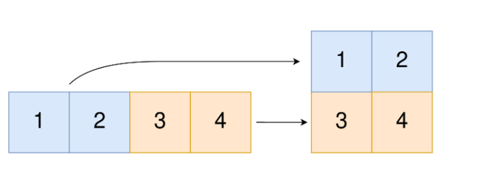
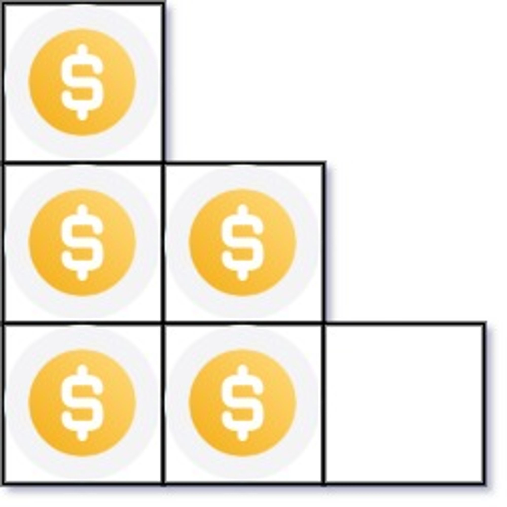

# Assignment-5 Questions & Solutions

💡 **Question-1:** Convert 1D Array Into 2D Array. You are given a 0-indexed 1-dimensional (1D) integer array original, and two integers, m and n. You are tasked with creating a 2-dimensional (2D) array with  m rows and n columns using all the elements from original.

The elements from indices 0 to n - 1 (inclusive) of original should form the first row of the constructed 2D array, the elements from indices n to 2 * n - 1 (inclusive) should form the second row of the constructed 2D array, and so on.

Return an m x n 2D array constructed according to the above procedure, or an empty 2D array if it is impossible.



💬 **Solution-1:**

```js
function construct2DArray(original, m, n) {
  if (original.length !== m * n) {
    return [];
  }

  const result = [];

  for (let i = 0; i < m; i++) {
    const row = [];
    for (let j = 0; j < n; j++) {
      const num = original[i * n + j];
      row.push(num);
    }
    result.push(row);
  }
  return result;
}

// Example:
const original = [1, 2, 3, 4];
const m = 2;
const n = 2;
const result = construct2DArray(original, m, n);
console.log(result); // Output: [[1, 2], [3, 4]]

```

<hr/>

💡 **Question-2:** You have n coins and you want to build a staircase with these coins. The staircase consists of k rows where the ith row has exactly i coins. The last row of the staircase **may be** incomplete.

Given the integer n, return the number of complete rows of the staircase you will build.



Example: Input: n = 5 Output: 2

💬 **Solution-2:**

```js
function arrangeCoins(n) {
  let left = 0;
  let right = n;
  while (left <= right) {
    const mid = Math.floor((left + right) / 2);
    const curr = (mid * (mid + 1)) / 2;

    if (curr === n) {
      return mid;
    }
    if (curr < n) {
      left = mid + 1;
    } else {
      right = mid - 1;
    }
  }
  return right;
}

// Example:
const n = 5;
const result = arrangeCoins(n);
console.log(result); // Output: 2

```

<hr/>

💡 **Question-3:** Given an integer array nums sorted in non-decreasing order, return an array of the squares of each number sorted in non-decreasing order.

Example: Input: nums = [-4,-1,0,3,10] Output: [0,1,9,16,100]

💬 **Solution-3:**

```js
function sortedSquares(nums) {
  const squares = [];
  for (let i = 0; i < nums.length; i++) {
    squares.push(nums[i] * nums[i]);
  }
  squares.sort((a, b) => a - b);
  return squares;
}

// Example:
const nums = [-4, -1, 0, 3, 10];
const result = sortedSquares(nums);
console.log(result); // Output: [0, 1, 9, 16, 100]

```

<hr/>

💡 **Question-4:** Given two 0-indexed integer arrays nums1 and nums2, return a list answer of size 2 where:

- answer[0] is a list of all distinct integers in nums1 which are not present in nums2.
- answer[1] is a list of all distinct integers in nums2 which are not present in nums1.

Example: Input: nums1 = [1,2,3], nums2 = [2,4,6] Output: [[1,3],[4,6]]

💬 **Solution-4:**

```js
function distinctNumbers(nums1, nums2) {
  const set1 = new Set(nums1);
  const set2 = new Set(nums2);
  const result1 = [];
  const result2 = [];
  
  for (let num of set1) {
    if (!set2.has(num)) {
      result1.push(num);
    }
  }

  for (let num of set2) {
    if (!set1.has(num)) {
      result2.push(num);
    }
  }
  return [result1, result2];
}

// Example:
const nums1 = [1, 2, 3];
const nums2 = [2, 4, 6];
const result = distinctNumbers(nums1, nums2);
console.log(result); // Output: [[1, 3], [4, 6]]

```

<hr/>

💡 **Question-5:** Given two integer arrays arr1 and arr2, and the integer d, return the distance value between the two arrays.

The distance value is defined as the number of elements arr1[i] such that there is not any element arr2[j] where |arr1[i]-arr2[j]| <= d.

Example: Input: arr1 = [4,5,8], arr2 = [10,9,1,8], d = 2 Output: 2

💬 **Solution-5:**

```js
function distanceValue(arr1, arr2, d) {
  let distance = 0;
  for (let i = 0; i < arr1.length; i++) {
    let hasCloseElement = false;
    for (let j = 0; j < arr2.length; j++) {
      if (Math.abs(arr1[i] - arr2[j]) <= d) {
        hasCloseElement = true;
        break;
      }
    }
    if (!hasCloseElement) {
      distance++;
    }
  }
  return distance;
}

// Example:
const arr1 = [4, 5, 8];
const arr2 = [10, 9, 1, 8];
const d = 2;
const result = distanceValue(arr1, arr2, d);
console.log(result); // Output: 2

```

<hr/>

💡 **Question-6:** Given an integer array nums of length n where all the integers of nums are in the range [1, n] and each integer appears once or twice, return an array of all the integers that appears twice.

You must write an algorithm that runs in O(n) time and uses only constant extra space.

Example: Input: nums = [4,3,2,7,8,2,3,1] Output [2, 3]

💬 **Solution-6:**

```js
function findDuplicates(nums) {
  const result = [];

  for (let i = 0; i < nums.length; i++) {
    const idx = Math.abs(nums[i]) - 1;
    if (nums[idx] < 0) {
      result.push(Math.abs(nums[i]));
    } else {
      nums[idx] *= -1;
    }
  }
  return result;
}

// Example:
const nums = [4, 3, 2, 7, 8, 2, 3, 1];
const result = findDuplicates(nums);
console.log(result); // Output: [2, 3]

```

<hr/>

💡 **Question-7:** Suppose an array of length n sorted in ascending order is rotated between 1 and n times. For example, the array nums = [0,1,2,4,5,6,7] might become:

- [4,5,6,7,0,1,2] if it was rotated 4 times.
- [0,1,2,4,5,6,7] if it was rotated 7 times.

Notice that rotating an array [a[0], a[1], a[2], ..., a[n-1]] 1 time results in the array [a[n-1], a[0], a[1], a[2], ..., a[n-2]].

Given the sorted rotated array nums of unique elements, return the minimum element of this array.

You must write an algorithm that runs in O(log n) time.

Example: Input: nums = [3,4,5,1,2] Output: 1

💬 **Solution-7:**

```js
function findMin(nums) {
  let left = 0;
  let right = nums.length - 1;

  while (left < right) {
    const mid = left + Math.floor((right - left) / 2);

    if (nums[mid] < nums[left] && nums[mid] < nums[right]) {
      right = mid;
    }
    else if (nums[mid] > nums[left] && nums[mid] > nums[right]) {
      left = mid + 1;
    }
    else if (nums[mid] > nums[right] && nums[mid] < nums[left]) {
      left = mid + 1;
    }
  }
  return nums[left];
}

// Example:
const nums = [3, 4, 5, 1, 2];
const result = findMin(nums);
console.log(result); // Output: 1

```

<hr/>

💡 **Question-8:** An integer array original is transformed into a doubled array changed by appending twice the value of every element in original, and then randomly shuffling the resulting array.

Given an array changed, return original if changed is a doubled array. If changed is not a doubled array, return an empty array. The elements in original may be returned in any order.

Example: Input: changed = [1,3,4,2,6,8] Output: [1,3,4]

💬 **Solution-8:**

```js
function findOriginalArray(changed) {
  const countMap = new Map();

  for (let num of changed) {
    countMap.set(num, (countMap.get(num) || 0) + 1);
  }
  changed.sort((a, b) => a - b);

  const original = [];

  for (let num of changed) {
    if (num % 2 === 0 && countMap.get(num / 2) > 0) {
      original.push(num / 2);
      countMap.set(num / 2, countMap.get(num / 2) - 1);
    } else if (countMap.get(num) > 0) {
      original.push(num);
      countMap.set(num, countMap.get(num) - 1);
    } else {
      return [];
    }
  }
  return original;
}

// Example:
const changed = [1, 3, 4, 2, 6, 8];
const result = findOriginalArray(changed);
console.log(result); // Output: [1, 3, 4]

```

<hr/>