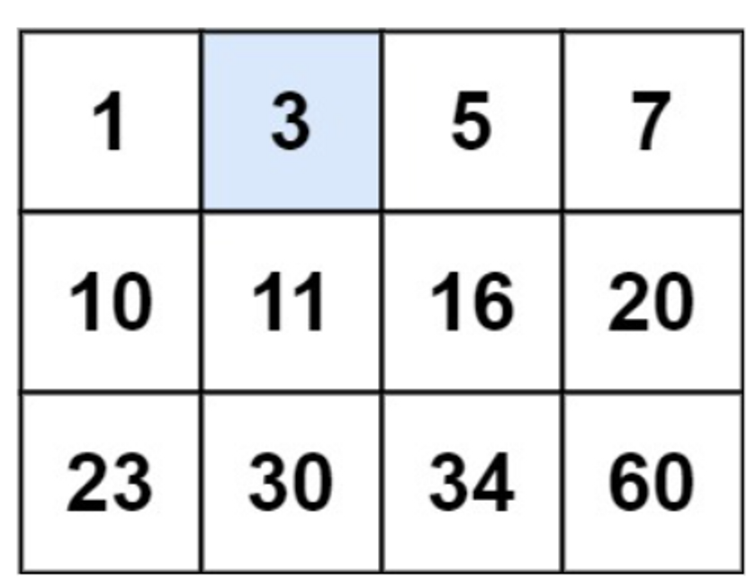
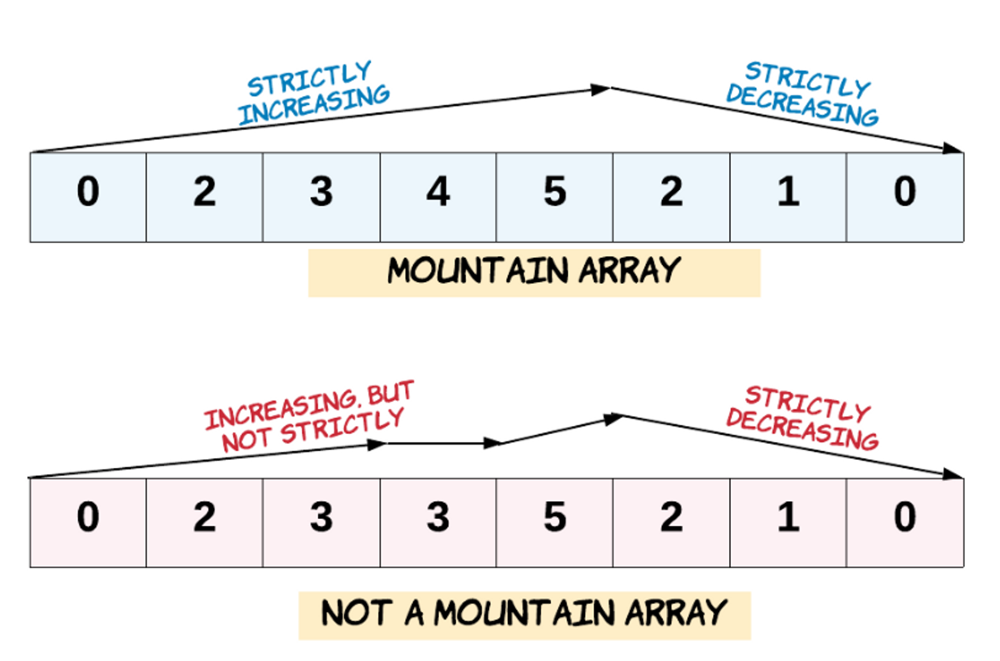
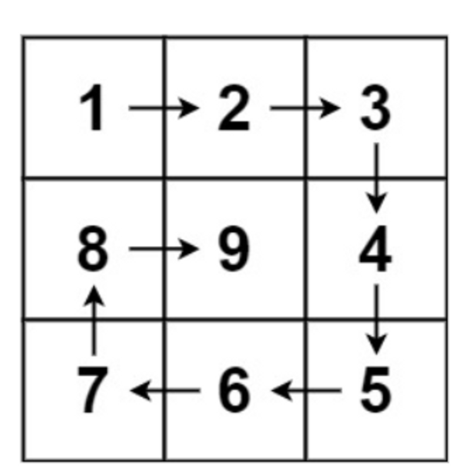
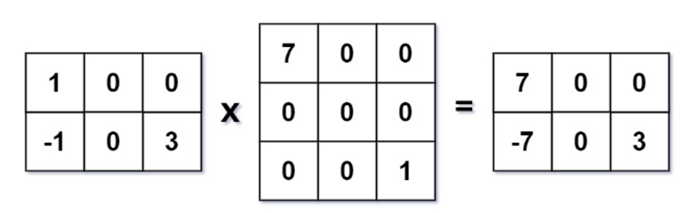

# Assignment-6 Questions & Solutions

💡 **Question-1:** A permutation perm of n + 1 integers of all the integers in the range [0, n] can be represented as a string s of length n where:

- s[i] == 'I' if perm[i] < perm[i + 1], and
- s[i] == 'D' if perm[i] > perm[i + 1].

Given a string s, reconstruct the permutation perm and return it. If there are multiple valid permutations perm, return any of them.

Example: Input: s = "IDID" Output: [0,4,1,3,2]

💬 **Solution-1:**

```js
function reconstructPermutation(s) {
  const n = s.length;
  let low = 0;
  let high = n;
  const perm = [];

  for (let i = 0; i < n; i++) {
    if (s[i] === 'I') {
      perm.push(low);
      low++;
    } else if (s[i] === 'D') {
      perm.push(high);
      high--;
    }
  }
  perm.push(low);
  return perm;
}

// Example:
const s = "IDID";
const perm = reconstructPermutation(s);
console.log(perm);

```

<hr/>

💡 **Question-2:** You are given an m x n integer matrix matrix with the following two properties:

- Each row is sorted in non-decreasing order.
- The first integer of each row is greater than the last integer of the previous row.

Given an integer target, return true *if* target *is in* matrix *or* false *otherwise*.

You must write a solution in O(log(m * n)) time complexity.

Example:



Input: matrix = [[1,3,5,7],[10,11,16,20],[23,30,34,60]], target = 3 Output: true

💬 **Solution-2:**

```js
function searchMatrix(matrix, target) {
  const m = matrix.length;
  const n = matrix[0].length;
  let left = 0;
  let right = m * n - 1;

  while (left <= right) {
    const mid = Math.floor((left + right) / 2);
    const row = Math.floor(mid / n);
    const col = mid % n;
    const value = matrix[row][col];
    if (value === target) {
      return true;
    } else if (value < target) {
      left = mid + 1;
    } else {
      right = mid - 1;
    }
  }
  return false;
}

// Example:
const matrix = [
  [1, 3, 5, 7],
  [10, 11, 16, 20],
  [23, 30, 34, 60]
];
const target = 3;
const result = searchMatrix(matrix, target);
console.log(result); // Output: true

```

<hr/>

💡 **Question-3:** Given an array of integers arr, return true if and only if it is a valid mountain array.
Recall that arr is a mountain array if and only if:

- arr.length >= 3
- There exists some i with 0 < i < arr.length - 1 such that:
    - arr[0] < arr[1] < ... < arr[i - 1] < arr[i]
    - arr[i] > arr[i + 1] > ... > arr[arr.length - 1]

    

Example: Input: arr = [2,1] Output: false

💬 **Solution-3:**

```js
function validMountainArray(arr) {
  const n = arr.length;
  if (n < 3) {
    return false;
  }

  let i = 1;
  while (i < n && arr[i] > arr[i - 1]) {
    i++;
  }
  if (i === 1 || i === n) {
    return false;
  }
  while (i < n && arr[i] < arr[i - 1]) {
    i++;
  }
  return i === n;
}

// Example:
const arr = [2, 1];
const isValidMountainArray = validMountainArray(arr);
console.log(isValidMountainArray); // Output: false

```

<hr/>

💡 **Question-4:** Given a binary array nums, return the maximum length of a contiguous subarray with an equal number of 0 and 1.

Example: Input: nums = [0,1] Output: 2

💬 **Solution-4:**

```js
function findMaxLength(nums) {
  const countMap = { 0: -1 };
  let count = 0;
  let maxLen = 0;

  for (let i = 0; i < nums.length; i++) {
    count += nums[i] === 1 ? 1 : -1;
    if (count === 0) {
      maxLen = Math.max(maxLen, i + 1);
    } else if (count in countMap) {
      maxLen = Math.max(maxLen, i - countMap[count]);
    } else {
      countMap[count] = i;
    }
  }
  return maxLen;
}

// Example:
const nums = [0, 1];
const maxLength = findMaxLength(nums);
console.log(maxLength); // Output: 2

```

<hr/>

💡 **Question-5:** The product sum of two equal-length arrays a and b is equal to the sum of a[i] * b[i] for all 0 <= i < a.length (0-indexed).

- For example, if a = [1,2,3,4] and b = [5,2,3,1], the product sum would be 1*5 + 2*2 + 3*3 + 4*1 = 22.

Given two arrays nums1 and nums2 of length n, return the minimum product sum if you are allowed to rearrange the order of the elements in nums1.

Example: Input: nums1 = [5,3,4,2], nums2 = [4,2,2,5] Output: 40

💬 **Solution-5:**

```js
function minProductSum(nums1, nums2) {
  const n = nums1.length;
  nums1.sort((a, b) => a - b);
  nums2.sort((a, b) => a - b);

  let minProductSum = 0;
  for (let i = 0; i < n; i++) {
    minProductSum += nums1[i] * nums2[n - 1 - i];
  }
  return minProductSum;
}

// Example:
const nums1 = [5, 3, 4, 2];
const nums2 = [4, 2, 2, 5];
const result = minProductSum(nums1, nums2);
console.log(result); // Output: 40

```

<hr/>

💡 **Question-6:** An integer array original is transformed into a doubled array changed by appending twice the value of every element in original, and then randomly shuffling the resulting array.

Given an array changed, return original if changed is a doubled array. If changed is not a doubled array, return an empty array. The elements in original may be returned in any order.

Example: Input: changed = [1,3,4,2,6,8] Output: [1,3,4]

💬 **Solution-6:**

```js
function findOriginalArray(changed) {
  if (changed.length % 2 !== 0) {
    return [];
  }
  const original = [];
  changed.sort((a, b) => a - b);

  for (let i = 0; i < changed.length; i++) {
    const num = changed[i] / 2;
    if (original.includes(num)) {
      original.splice(original.indexOf(num), 1);
    } else {
      original.push(num);
    }
  }
  if (original.length === 0) {
    return [];
  }
  return original;
}

// Example:
const changed = [1, 3, 4, 2, 6, 8];
const original = findOriginalArray(changed);
console.log(original); // Output: [1, 3, 4]

```

<hr/>

💡 **Question-7:** Given a positive integer n, generate an n x n matrix filled with elements from 1 to n2 in spiral order.


Example: Input: n = 3 Output: [[1,2,3],[8,9,4],[7,6,5]]

💬 **Solution-7:**

```js
function generateMatrix(n) {
  const matrix = Array.from({ length: n }, () => Array(n).fill(0));

  let rowStart = 0;
  let rowEnd = n - 1;
  let colStart = 0;
  let colEnd = n - 1;

  let num = 1;
  while (num <= n * n) {
    for (let i = colStart; i <= colEnd; i++) {
      matrix[rowStart][i] = num++;
    }
    rowStart++;
    for (let i = rowStart; i <= rowEnd; i++) {
      matrix[i][colEnd] = num++;
    }
    colEnd--;
    for (let i = colEnd; i >= colStart; i--) {
      matrix[rowEnd][i] = num++;
    }
    rowEnd--;
    for (let i = rowEnd; i >= rowStart; i--) {
      matrix[i][colStart] = num++;
    }
    colStart++;
  }
  return matrix;
}

// Example:
const n = 3;
const matrix = generateMatrix(n);
console.log(matrix);
// Output: [[1, 2, 3], [8, 9, 4], [7, 6, 5]]

```

<hr/>

💡 **Question-8:** Given two sparse matrices mat1 of size m x k and mat2 of size k x n, return the result of mat1 x mat2. You may assume that multiplication is always possible. 



Example: Input: mat1 = [[1,0,0],[-1,0,3]], mat2 = [[7,0,0],[0,0,0],[0,0,1]] Output: [[7,0,0],[-7,0,3]]

💬 **Solution-8:**

```js
function multiply(mat1, mat2) {
  const m = mat1.length;
  const n = mat2[0].length;
  const k = mat1[0].length;
  const result = Array.from({ length: m }, () => Array(n).fill(0));

  for (let i = 0; i < m; i++) {
    for (let j = 0; j < n; j++) {
      let sum = 0;
      for (let l = 0; l < k; l++) {
        sum += mat1[i][l] * mat2[l][j];
      }
      result[i][j] = sum;
    }
  }
  return result;
}

// Example:
const mat1 = [[1, 0, 0], [-1, 0, 3]];
const mat2 = [[7, 0, 0], [0, 0, 0], [0, 0, 1]];
const result = multiply(mat1, mat2);
console.log(result);
// Output: [[7, 0, 0], [-7, 0, 3]]

```

<hr/>
