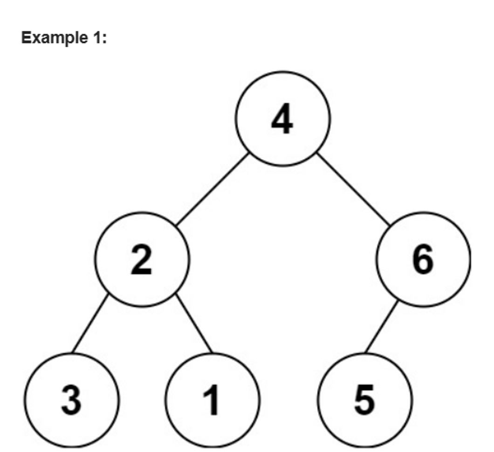

# Assignment-8 Questions & Solutions

💡 **Question-1:** Given two strings s1 and s2, return the lowest ASCII sum of deleted characters to make two strings equal.

Example: Input: s1 = "sea", s2 = "eat" Output: 231

💬 **Solution-1:**

```js
function minimumDeleteSum(s1, s2) {
  const m = s1.length;
  const n = s2.length;

  // 2D array to store the minimum ASCII sum
  const dp = Array(m + 1);
  for (let i = 0; i <= m; i++) {
    dp[i] = Array(n + 1).fill(0);
  }

  // cumulative sum for s1
  for (let i = 1; i <= m; i++) {
    dp[i][0] = dp[i - 1][0] + s1.charCodeAt(i - 1);
  }

  // cumulative sum for s2
  for (let j = 1; j <= n; j++) {
    dp[0][j] = dp[0][j - 1] + s2.charCodeAt(j - 1);
  }

  // Fill in the dp array
  for (let i = 1; i <= m; i++) {
    for (let j = 1; j <= n; j++) {
      if (s1.charAt(i - 1) === s2.charAt(j - 1)) {
        dp[i][j] = dp[i - 1][j - 1];
      } else {
        dp[i][j] = Math.min(
          dp[i - 1][j] + s1.charCodeAt(i - 1), // delete char from s1
          dp[i][j - 1] + s2.charCodeAt(j - 1) // delete char from s2
        );
      }
    }
  }
  return dp[m][n];
}

// Example:
const s1 = "sea";
const s2 = "eat";
const result = minimumDeleteSum(s1, s2);
console.log(result); // Output: 231
```

<hr/>

💡 **Question-2:** Given a string s containing only three types of characters: '(', ')' and '*', return true if s is valid.

The following rules define a valid string:

- Any left parenthesis '(' must have a corresponding right parenthesis ')'.
- Any right parenthesis ')' must have a corresponding left parenthesis '('.
- Left parenthesis '(' must go before the corresponding right parenthesis ')'.
- '*' could be treated as a single right parenthesis ')' or a single left parenthesis '(' or an empty string "".

Example: Input: s = "()" Output: true

💬 **Solution-2:**

```js
function isValid(s) {
  const stack = [];
  const starStack = [];

  for (let i = 0; i < s.length; i++) {
    const char = s.charAt(i);
    if (char === '(') {
      stack.push(i);
    } else if (char === '*') {
      starStack.push(i);
    } else {
      if (stack.length > 0) {
        stack.pop();
      } else if (starStack.length > 0) {
        starStack.pop();
      } else {
        return false;
      }
    }
  }
  while (stack.length > 0 && starStack.length > 0) {
    if (stack.pop() > starStack.pop()) {
      return false;
    }
  }
  return stack.length === 0;
}

// Example:
const s = "()";
const result = isValid(s);
console.log(result); // Output: true
```

<hr/>

💡 **Question-3:** Given two strings word1 and word2, return the minimum number of steps required to make word1 and word2 the same.

In one step, you can delete exactly one character in either string.

Example: Input: word1 = "sea", word2 = "eat" Output: 2

💬 **Solution-3:**

```js
function minDistance(word1, word2) {
  const m = word1.length;
  const n = word2.length;

  const dp = Array(m + 1);
  for (let i = 0; i <= m; i++) {
    dp[i] = Array(n + 1).fill(0);
  }

  for (let i = 1; i <= m; i++) {
    for (let j = 1; j <= n; j++) {
      if (word1.charAt(i - 1) === word2.charAt(j - 1)) {
        dp[i][j] = dp[i - 1][j - 1] + 1;
      } else {
        dp[i][j] = Math.max(dp[i - 1][j], dp[i][j - 1]);
      }
    }
  }
  const lcsLength = dp[m][n];
  return m + n - 2 * lcsLength;
}

// Example:
const word1 = "sea";
const word2 = "eat";
const result = minDistance(word1, word2);
console.log(result); // Output: 2
```

<hr/>

💡 **Question-4:** You need to construct a binary tree from a string consisting of parenthesis and integers.

The whole input represents a binary tree. It contains an integer followed by zero, one or two pairs of parenthesis. The integer represents the root's value and a pair of parenthesis contains a child binary tree with the same structure.
You always start to construct the **left** child node of the parent first if it exists.



💬 **Solution-4:**

```js
class TreeNode {
  constructor(val) {
    this.val = val;
    this.left = null;
    this.right = null;
  }
}

function str2tree(s) {
  if (s.length === 0) {
    return null;
  }

  const firstParen = s.indexOf("(");

  if (firstParen === -1) {
    return new TreeNode(parseInt(s));
  }

  const rootVal = parseInt(s.substring(0, firstParen));
  const root = new TreeNode(rootVal);

  let start = firstParen;
  let openParenCount = 0;

  for (let i = start; i < s.length; i++) {
    if (s[i] === "(") {
      openParenCount++;
    } else if (s[i] === ")") {
      openParenCount--;
    }

    if (openParenCount === 0 && start === firstParen) {
      root.left = str2tree(s.substring(start + 1, i));
      start = i + 1;
    } else if (openParenCount === 0) {
      root.right = str2tree(s.substring(start + 1, i));
    }
  }
  return root;
}

function inorderTraversal(root) {
  const result = [];

  function traverse(node) {
    if (node) {
      traverse(node.left);
      result.push(node.val);
      traverse(node.right);
    }
  }
  traverse(root);
  return result;
}

// Example:
const s = "4(2(3)(1))(6(5))";
const root = str2tree(s);
const result = inorderTraversal(root);
console.log(result); // Output: [4, 2, 3, 1, 6, 5]
```

<hr/>

💡 **Question-5:** Given an array of characters chars, compress it using the following algorithm:

Begin with an empty string s. For each group of consecutive repeating characters in chars:

- If the group's length is 1, append the character to s.
- Otherwise, append the character followed by the group's length.

The compressed string s should not be returned separately, but instead, be stored in the input character array chars. Note that group lengths that are 10 or longer will be split into multiple characters in chars.

After you are done modifying the input array, return the new length of the array.

You must write an algorithm that uses only constant extra space.

Example: Input: chars = ["a","a","b","b","c","c","c"] Output: Return 6, and the first 6 characters of the input array should be: ["a","2","b","2","c","3"]

💬 **Solution-5:**

```js
function compress(chars) {
  let writeIndex = 0;
  let currentIndex = 0;

  while (currentIndex < chars.length) {
    let currentChar = chars[currentIndex];
    let count = 0;

    while (currentIndex < chars.length && chars[currentIndex] === currentChar) {
      currentIndex++;
      count++;
    }
    chars[writeIndex] = currentChar;
    writeIndex++;

    if (count > 1) {
      const countStr = count.toString();

      for (let i = 0; i < countStr.length; i++) {
        chars[writeIndex] = countStr[i];
        writeIndex++;
      }
    }
  }
  return writeIndex;
}

// Example:
const chars = ["a", "a", "b", "b", "c", "c", "c"];
const compressedLength = compress(chars);
const compressedChars = chars.slice(0, compressedLength);
console.log(compressedLength); // Output: 6
console.log(compressedChars); // Output: ["a", "2", "b", "2", "c", "3"]
```

<hr/>

💡 **Question-6:** Given two strings s and p, return an array of all the start indices of p's anagrams in s. You may return the answer in any order.

An Anagram is a word or phrase formed by rearranging the letters of a different word or phrase, typically using all the original letters exactly once.

Example: Input: s = "cbaebabacd", p = "abc" Output: [0,6]

💬 **Solution-6:**

```js
function findAnagrams(s, p) {
  const result = [];
  const pFreqMap = {};

  for (let char of p) {
    pFreqMap[char] = (pFreqMap[char] || 0) + 1;
  }

  let windowStart = 0;
  let windowEnd = 0;
  let matched = 0;

  while (windowEnd < s.length) {
    const char = s[windowEnd];
    if (char in pFreqMap) {
      pFreqMap[char]--;
      if (pFreqMap[char] === 0) {
        matched++;
      }
    }

    windowEnd++;
    if (matched === Object.keys(pFreqMap).length) {
      result.push(windowStart);
    }

    if (windowEnd - windowStart === p.length) {
      const leftChar = s[windowStart];

      if (leftChar in pFreqMap) {
        if (pFreqMap[leftChar] === 0) {
          matched--;
        }
        pFreqMap[leftChar]++;
      }
      windowStart++;
    }
  }
  return result;
}

// Example:
const s = "cbaebabacd";
const p = "abc";
const result = findAnagrams(s, p);
console.log(result); // Output: [0, 6]
```

<hr/>

💡 **Question-7:** Given an encoded string, return its decoded string. The encoding rule is: k[encoded_string], where the encoded_string inside the square brackets is being repeated exactly k times. Note that k is guaranteed to be a positive integer.

You may assume that the input string is always valid; there are no extra white spaces, square brackets are well-formed, etc. Furthermore, you may assume that the original data does not contain any digits and that digits are only for those repeat numbers, k. For example, there will not be input like 3a or 2[4].

The test cases are generated so that the length of the output will never exceed 105.

Example: Input: s = "3[a]2[bc]" Output: "aaabcbc"

💬 **Solution-7:**

```js
function decodeString(s) {
  const stack = [];

  for (let char of s) {
    if (char === ']') {
      let decodedString = '';
      while (stack[stack.length - 1] !== '[') {
        decodedString = stack.pop() + decodedString;
      }
      stack.pop();

      let repetitionCount = '';

      while (stack.length > 0 && !isNaN(stack[stack.length - 1])) {
        repetitionCount = stack.pop() + repetitionCount;
      }
      repetitionCount = parseInt(repetitionCount, 10);
      decodedString = decodedString.repeat(repetitionCount);
      stack.push(...decodedString);
    } else {
      stack.push(char);
    }
  }
  return stack.join('');
}

// Example:
const s = '3[a]2[bc]';
const decodedString = decodeString(s);
console.log(decodedString); // Output: 'aaabcbc'
```

<hr/>

💡 **Question-8:** Given two strings s and goal, return true if you can swap two letters in s *so the result is equal to goal, otherwise, return false.

Swapping letters is defined as taking two indices i and j (0-indexed) such that i != j and swapping the characters at s[i] and s[j].

- For example, swapping at indices 0 and 2 in "abcd" results in "cbad".

Example: Input: s = "ab", goal = "ba" Output: true

💬 **Solution-8:**

```js
function buddyStrings(s, goal) {
  if (s.length !== goal.length) {
    return false;
  }

  if (s === goal) {
    const charCount = new Set(s).size;
    return charCount < s.length;
  }

  const diffIndices = [];
  for (let i = 0; i < s.length; i++) {
    if (s[i] !== goal[i]) {
      diffIndices.push(i);
    }
  }

  if (diffIndices.length !== 2) {
    return false;
  }
  const [index1, index2] = diffIndices;
  return s[index1] === goal[index2] && s[index2] === goal[index1];
}

// Example:
const s = 'ab';
const goal = 'ba';
const result = buddyStrings(s, goal);
console.log(result); // Output: true
```

<hr/>