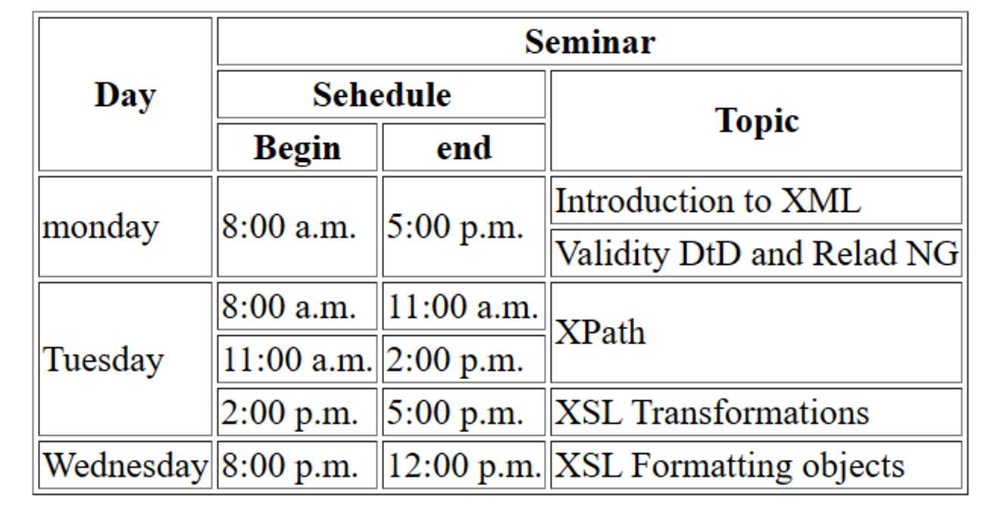

# Assignment-1 Questions & Solutions

💡 **Question-1:**  ```<!DOCTYPE html>``` is it a tag of html? If not, what is it and why do we use it?

💬 **Solution-1:** 


`<!DOCTYPE html>` is not a tag in HTML; it is called a doctype declaration. It is used to specify the version of HTML or XHTML that a web page is written in. The `<!DOCTYPE html>` declaration specifically indicates that the web page is written in HTML5, the latest version of HTML.

The doctype declaration is placed at the very beginning of an HTML document, before the `<html>` tag. It informs the web browser about the type of markup language used and helps it to render the page correctly. The declaration tells the browser how to interpret the HTML elements, attributes, and other features of the document.

<hr/>

💡 **Question-2:** Explain Semantic tags in html? And why do we need it?

💬 **Solution-2:**

Semantic tags in HTML are a set of elements that provide meaning and structure to the content within a web page. They convey the purpose or role of the enclosed content, making it more accessible to both humans and machines (such as search engines and assistive technologies). Semantic tags go beyond mere formatting or visual presentation and focus on the underlying meaning of the content.

Here are some commonly used semantic tags in HTML5:

`<header>`: Represents the introductory content or a container for a group of introductory content at the top of a document or section.

`<nav>`: Defines a section of navigation links.

`<main>`: Indicates the main content of a document, excluding headers, footers, and navigation.

`<article>`: Represents a self-contained composition that can be independently distributed or reusable, such as a blog post, news article, or forum post.

`<section>`: Defines a standalone section that is thematically related within a document, such as chapters, tabbed content, or different parts of a webpage.

Using semantic tags has several benefits:

- Accessibility: Semantic tags provide clearer structure to assistive technologies like screen readers, making it easier for visually impaired users to navigate and understand the content.

- Search Engine Optimization (SEO): Search engines can better understand the organization and hierarchy of the content, potentially improving search rankings and visibility.

- Code Maintainability: By using semantic tags, the code becomes more self-explanatory and easier to maintain, especially when working collaboratively or revisiting the codebase after a long time.

<hr/>

💡 **Question-3:** Differentiate between HTML Tags and Elements?

💬 **Solution-3:**

HTML Tags: HTML tags are used to define the structure and formatting of content within an HTML document. They are represented by opening and closing angle brackets (< and >), enclosing a specific keyword. For example, `<p>` is the tag used to define a paragraph in HTML.

HTML tags are like containers that mark the beginning and end of specific sections or elements in an HTML document. They define the structure and delineate different parts of the content. HTML tags can have attributes that provide additional information or modify the behavior of the tag

HTML Elements: HTML elements are created by combining HTML tags with their content. An HTML element consists of an opening tag, content, and a closing tag. The opening tag indicates the start of an element, the closing tag marks the end, and the content is the information or nested elements contained within.

For example, the following code represents an HTML element:

`<h1>Welcome to my website</h1>`

In this case, `<h1>` is the opening tag, "Welcome to my website" is the content, and </h1> is the closing tag. Together, they form an <h1> element that represents a heading in HTML.

<hr/>

💡 **Question-4:** Build Your Resume using HTML only

💬 **Solution-4:**

### [Answer-4-Resume-Github Code Link](https://github.com/ShubhamSingh03/Placement_Assignment-Ineuron/blob/main/HTML/answer-4-resume.html)

<hr/>

💡 **Question-5:** Write HTML code so that it looks like the below image:


💬 **Solution-5:**

### [Answer-5-Layout-Github Code Link](https://github.com/ShubhamSingh03/Placement_Assignment-Ineuron/blob/main/HTML/answer-5-layout.html)

<hr/>


💡 **Question-6:** What are some of the advantages of HTML5 over its previous versions?

💬 **Solution-6:**

Here are some of the key advantages of HTML5:

1. Simplified Doctype Declaration: HTML5 introduced a simplified doctype declaration, `<!DOCTYPE html>`, which is shorter and easier to remember compared to the complex doctype declarations required in previous versions.

2. Enhanced Semantics: HTML5 introduced new semantic elements like `<header>`, `<nav>`, `<section>`, `<article>`, `<footer>`, and more. These semantic elements provide better structure and meaning to the content, improving accessibility, search engine optimization, and code clarity.

3. Rich Multimedia Support: HTML5 includes built-in support for multimedia elements, such as `<audio>` and `<video`>`, eliminating the need for third-party plugins like Flash. This enables seamless embedding and playback of audio and video content directly within web pages.

4. Improved Form Handling: HTML5 introduced new input types and attributes, such as date, email, url, number, placeholder, and more. These enhancements make it easier to develop and validate forms, improving user experience and reducing the need for JavaScript-based form validation.

5. Offline Support: HTML5 introduced the concept of offline web applications using technologies like the Application Cache and the Local Storage API. This allows web applications to function even when the user is offline or experiencing a poor internet connection, enhancing user engagement and productivity.

6. Improved Performance and Efficiency: HTML5 introduced several performance optimizations, including asynchronous script loading, local data storage, and reduced reliance on server communication. These optimizations lead to faster page loading times, improved responsiveness, and reduced bandwidth usage.

<hr/>


💡 **Question-7:** Create a simple Music player using html only

💬 **Solution-7:**

### [Answer-7-Music_Player-Github Code Link](https://github.com/ShubhamSingh03/Placement_Assignment-Ineuron/blob/main/HTML/answer-7-music_player.html)

<hr/>

💡 **Question-8:** What is the difference between ```<figure>``` tag and `````` tag?

💬 **Solution-8:**

`` tag: The `` tag is specifically used to embed images within an HTML document. It is a self-closing tag that does not require a closing tag. The `` tag requires the src attribute to specify the source (URL or file path) of the image file, and it is commonly used in combination with the alt attribute to provide alternative text for the image.

``

`<figure>` tag: The `<figure>` tag is used to encapsulate self-contained content, such as images, illustrations, diagrams, code snippets, or multimedia objects within an HTML document. It provides a semantic container for a group of related content that can be referenced as a whole. The `<figure>` tag can be used in conjunction with the `<figcaption>` tag to provide a caption or description for the content within.

```css
<figure>
  
  <figcaption>Caption for the image</figcaption>
</figure>
```

`<figure>` tag encapsulates the `` tag along with its associated caption provided by the `<figcaption>` tag. This helps to semantically group and associate the image and its caption together

<hr/>


💡 **Question-9:** What’s the difference between html tag and attribute and give example of some global attributes?

💬 **Solution-9:**

The difference between an HTML tag and an attribute lies in their respective roles within an HTML element:

HTML Tag: An HTML tag is the element's name surrounded by angle brackets (`<` and `>`). Tags define the structure and type of an element, and they often enclose content. For example, `<p>` is the tag used to define a paragraph element in HTML.

Attribute: An attribute is used within an HTML tag to provide additional information or modify the behavior of an element. Attributes are specified within the opening tag of an element and consist of a name and a value.

Here are some examples of global attributes, which can be used on most HTML elements:

1. class: Specifies one or more class names to associate an element with a CSS class for styling or JavaScript manipulation.
Example: `<div class="container">...</div>`

2. id: Provides a unique identifier for an element, which can be used to target and style or manipulate the element using JavaScript.
Example: `<h1 id="heading">Hello, world!</h1>`

3. style: Allows inline CSS styling to be applied directly to an element.
Example: `<p style="color: red;">This text is red.</p>`

4. data: Allows the addition of custom data attributes to elements, which can be accessed using JavaScript for storing and retrieving data.
Example: `<button data-action="delete" data-id="123">Delete</button>`

5. title: Provides additional information or a tooltip for an element when the user hovers over it.
Example: `<a href="#"  title="Click me!">Link</a>`

<hr/>

💡 **Question-10:** Write Html code so that it looks like the below image:



💬 **Solution-10:**

### [Answer-10-Table-Github Code Link](https://github.com/ShubhamSingh03/Placement_Assignment-Ineuron/blob/main/HTML/answer-10-table.html)

<hr/>