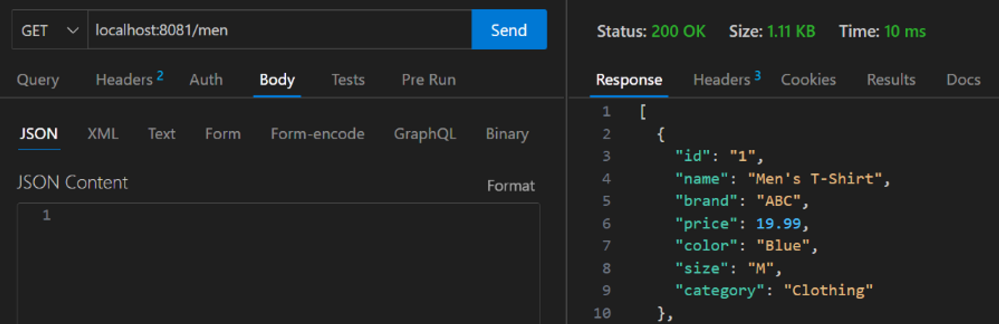
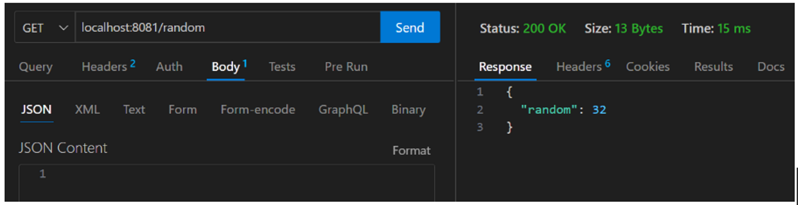

# Assignment-10 Questions & Solutions

💡 **Question-1:** Explain Middlewares in NodeJS ?

💬 **Solution-1:** 

In Node.js, middleware is a concept that refers to functions or modules that sit between the incoming request and the outgoing response in the application's request-response cycle. Middleware functions have access to the request and response objects, and they can perform operations, modify data, or add functionality before passing the request to the next middleware or terminating the request-response cycle.

Middleware functions can be used for a variety of purposes in a Node.js application, such as:

1. Logging: Middleware can log request details, such as the HTTP method, URL, and timestamp, to provide insight into the application's activity. It helps in debugging, monitoring, and analyzing the application's behavior.

2. Authentication and Authorization: Middleware can handle authentication and authorization processes. It can verify user credentials, check access permissions, and restrict access to certain routes or resources based on user roles or permissions.

3. Error Handling: Middleware can catch and handle errors that occur during the request-response cycle. It can log the error, format error responses, and provide appropriate error messages to the client.

4. Request Parsing and Data Transformation: Middleware can parse request bodies and transform data. It can handle JSON, URL-encoded, or multipart form data, validate input, sanitize data, and prepare it for further processing.

5. Caching: Middleware can implement caching mechanisms to improve performance. It can cache responses and serve them directly for subsequent similar requests, reducing the need for repeated processing.

<hr/>

💡 **Question-2:**  Why use Express Over NodeJS ?

💬 **Solution-2:** 

Express is a web application framework built on top of Node.js. While Node.js provides the core runtime environment for server-side JavaScript, Express enhances it by providing a set of features and abstractions that simplify the process of building web applications. Here are some reasons why we might choose to use Express over using Node.js alone:

1. Simplified Routing: Express provides an easy-to-use routing system that simplifies the management of different routes and HTTP methods. It allows to define routes and their corresponding handlers, making it straightforward to handle different endpoints and HTTP requests.

2. Middleware Support: Express has built-in middleware support that allows to add modular middleware functions to the application's request-response pipeline. This simplifies tasks such as request parsing, authentication, error handling, and logging. The middleware system enables better code organization, reusability, and separation of concerns.

3. Template Engine Integration: Express integrates well with various template engines, such as EJS, Pug, and Handlebars. This makes it easy to generate dynamic HTML pages by rendering templates with data from the server.

4. Simpler Error Handling: Express provides an error-handling middleware that simplifies error handling and centralizes error management for the application. It allows to define error-handling middleware functions to handle different types of errors and provides a consistent way to send error responses to clients.

5. Modularity and Extensibility: Express follows a modular approach, allowing to easily add additional libraries, middleware, or custom functionality to application. It has a large ecosystem of third-party middleware and extensions that provide additional features and integrations.

<hr/>

💡 **Question-3:**  What are REST API ?

💬 **Solution-3:** 

REST (Representational State Transfer) is an architectural style that defines a set of constraints for building web services. REST APIs (Application Programming Interfaces) are interfaces that adhere to the principles of REST and allow clients (such as web applications, mobile apps, or other services) to interact with server-side resources over the web.

Here are some key characteristics and principles of REST APIs:

1. Resource-Based: REST APIs are centered around resources, which can be any entity or object that the API manages. Each resource is identified by a unique URL (Uniform Resource Locator) or URI (Uniform Resource Identifier).

2. Stateless: REST APIs are stateless, meaning that each request from the client to the server should contain all the necessary information to process that request. The server does not store any client-specific state between requests.

3. Uniform Interface: REST APIs use a uniform and standardized set of HTTP methods (verbs) to perform actions on resources. The most common HTTP methods used in REST are GET (retrieve a resource), POST (create a new resource), PUT/PATCH (update a resource), and DELETE (remove a resource).

4. Representation-Oriented: REST APIs transfer representations of resources between the client and server. The representation can be in various formats, such as JSON, XML, or HTML. Clients can request specific representations of resources based on their preferences.

5. State Transfer: REST APIs enable the transfer of resource state between the client and server. The server responds to client requests with the current state of the requested resource or provides instructions for manipulating the resource's state.

<hr/>

💡 **Question-4:** What is the use of MongoDB?

💬 **Solution-4:** 

MongoDB is a popular NoSQL database management system that provides a flexible and scalable solution for storing and retrieving data. It is designed to handle large amounts of unstructured or semi-structured data, making it suitable for a wide range of applications and use cases. Here are some key uses and advantages of MongoDB:

1. Flexible Document Model: MongoDB uses a flexible document model, where data is stored in JSON-like documents called BSON (Binary JSON). This allows developers to store data in a way that closely matches their application's data model. The document model also enables nested structures and dynamic schemas, allowing easy updates and modifications to the data without requiring a predefined schema.

2. Scalability and Performance: MongoDB is designed to scale horizontally across multiple servers, known as a cluster. It can handle large amounts of data and high traffic loads by distributing data and processing across multiple nodes. MongoDB provides automatic sharding, which partitions data across multiple servers, and allows for seamless scaling as the data and user load increases.

3. High Availability: MongoDB provides high availability through replica sets. A replica set is a group of MongoDB nodes that maintain the same data set. If a primary node fails, a replica set automatically elects a new primary node, ensuring continuous availability of the database. This replication mechanism provides fault tolerance and data redundancy.

4. Querying and Indexing: MongoDB offers powerful querying capabilities using a flexible query language. It supports rich query expressions, including field projections, sorting, filtering, and aggregation. MongoDB also supports indexing, which improves query performance by creating indexes on fields or combinations of fields commonly used in queries.

5. Schema Evolution and Data Modeling: MongoDB's flexible schema allows for easy data modeling and schema evolution. It can adapt to changing requirements and evolving data structures without downtime or complex migrations. This flexibility makes MongoDB suitable for agile development and rapid prototyping.

<hr/>

💡 **Question-5:** What is Mongoose and how does it relate to MongoDB?

💬 **Solution-5:** 

Mongoose is an Object-Data Modeling (ODM) library for Node.js that provides a higher-level abstraction and additional features on top of the MongoDB driver. It simplifies the interaction with MongoDB by providing a schema-based solution for modeling application data and enforcing data validation.

Here's how Mongoose relates to MongoDB:

1. Schema Definition: With Mongoose, we can define our data structure using schemas. A schema is a blueprint that defines the shape and constraints of the data stored in a MongoDB collection. It allows to specify the fields, their types, default values, validation rules, and more. The schema helps maintain consistency and structure in the data.

2. Modeling: Mongoose allows to create models based on the defined schemas. A model represents a MongoDB collection and provides an interface for interacting with the data in that collection. Models define methods for common database operations such as querying, inserting, updating, and deleting documents. They encapsulate the business logic and provide a structured way to interact with MongoDB.

3. Data Validation: Mongoose provides built-in data validation capabilities. We can define validation rules and constraints within the schema, ensuring that the data meets the desired requirements before saving it to the database. Mongoose performs validation automatically when manipulating data through models, helping to maintain data integrity.

4. Middleware: Mongoose supports middleware functions that allows to hook into certain events in the document lifecycle, such as before saving or removing a document. Middleware functions enables to perform additional operations or modify data before or after certain actions occur. This can be useful for tasks like data normalization, encryption, or triggering external processes.

5. Database Connection Management: Mongoose handles the connection management with MongoDB for us. It provides a connection pool and manages connections to the MongoDB server, ensuring efficient and reliable communication between the application and the database.

<hr/>

💡 **Question-6:** Build a Server Using Http Module NodeJS with api endpoints for Getting Products Data

  ‘/’ → send msg as “Welcome to Men & Women Dummy Data”

  ‘/men’ → send 10 products data of men

  ‘/women’ → send 10 products data of women

  ‘/other’ → send response as page not found



💬 **Solution-6:** 

Firstly, creating a file such as server.js, and run it using Node.js.

```js
const http = require('http');

const server = http.createServer((req, res) => {
  if (req.url === '/') {
    res.writeHead(200, { 'Content-Type': 'text/plain' });
    res.end('Welcome to Men & Women Dummy Data');
  } else if (req.url === '/men') {
    const menProducts = [
      // Array of 10 products data for men
      { name: 'Product 1', price: 10 },
      { name: 'Product 2', price: 20 },
      // ...
    ];
    res.writeHead(200, { 'Content-Type': 'application/json' });
    res.end(JSON.stringify(menProducts));
  } else if (req.url === '/women') {
    const womenProducts = [
      // Array of 10 products data for women
      { name: 'Product A', price: 15 },
      { name: 'Product B', price: 25 },
      // ...
    ];
    res.writeHead(200, { 'Content-Type': 'application/json' });
    res.end(JSON.stringify(womenProducts));
  } else {
    res.writeHead(404, { 'Content-Type': 'text/plain' });
    res.end('Page not found');
  }
});

const port = 3000;
server.listen(port, () => {
  console.log(`Server is running on http://localhost:${port}`);
});
```

The server will listen on port 3000, and we can access the API endpoints as:

- `http://localhost:3000/` will return the message "Welcome to Men & Women Dummy Data".
- `http://localhost:3000/men` will return an array of 10 products data for men.
- `http://localhost:3000/women` will return an array of 10 products data for women.
- Any other URL will return a "Page not found" message.

<hr/>

💡 **Question-7:** Build a Server that Generate Random Number Using Express
‘/random’ → send random number in response {random:10}



💬 **Solution-7:** 

Firstly, creating a file such as server.js, and run it using Node.js.

```js
const express = require('express');
const app = express();
const port = 3000;

app.get('/random', (req, res) => {
  const randomNumber = Math.floor(Math.random() * 100);
  res.json({ random: randomNumber });
});

app.listen(port, () => {
  console.log(`Server is running on http://localhost:${port}`);
});
```

The server will listen on port 3000, and we can access the `/random` endpoint to get a random number.

When visiting `http://localhost:3000/random`, the server will respond with a JSON object containing a random number. For example:

```json
{
  "random": 42
}
```

<hr/>

💡 **Question-8:** Create a Backend For Counter Web App with Api Endpoint for Managing Counter Using Express

- ‘/’ → send counter data as {counter:counter}
- `/increment` → increment counter by 1 and send in response latest data as {counter:counter}
- `/decrement` → decrement counter by 1 and send in response latest data as {counter:counter}

💬 **Solution-8:** 

Firstly, creating a file such as server.js, and run it using Node.js.

```js
const express = require('express');
const app = express();
const port = 3000;

let counter = 0;

app.get('/', (req, res) => {
  res.json({ counter });
});

app.get('/increment', (req, res) => {
  counter++;
  res.json({ counter });
});

app.get('/decrement', (req, res) => {
  counter--;
  res.json({ counter });
});

app.listen(port, () => {
  console.log(`Server is running on http://localhost:${port}`);
});
```

The server will listen on port 3000, and we can access the following API endpoints:

- `http://localhost:3000/` will return the current value of the counter as a JSON object.
- `http://localhost:3000/increment` will increment the counter by 1 and return the latest value of the counter as a JSON object.
- `http://localhost:3000/decrement` will decrement the counter by 1 and return the latest value of the counter as a JSON object.

<hr/>

💡 **Question-9:** You are tasked with building the backend for a Todo web application. The application allows users to create, update, and delete tasks in their to-do list with Api Endpoint as mentioned below:

`/` -->  send all the todos which are created by user

`/add` --> to create todo create a middleware to validate user providing all the mandatory input (task), if user doesn't provide task as input send resp as validation failed

`/update/:id`  --> to update todo with Todo Id, after updating send resp as {msg:"todo update successfully",data:allTodos}

`/delete/:id` -->  to update todo with Todo id, after deleting send resp as {msg:"todo deleted",data:allTodos}

💬 **Solution-9:** 

Firstly, creating a file such as server.js, and run it using Node.js.

```js
const express = require('express');
const app = express();
const port = 3000;

// Middleware to parse JSON request bodies
app.use(express.json());

let todos = [];

app.get('/', (req, res) => {
  res.json(todos);
});

// Middleware to validate the task input
const validateTaskInput = (req, res, next) => {
  const { task } = req.body;
  if (!task) {
    res.status(400).json({ error: 'Task is required' });
  } else {
    next();
  }
};

app.post('/add', validateTaskInput, (req, res) => {
  const { task } = req.body;
  const todo = { id: Date.now(), task };
  todos.push(todo);
  res.json({ msg: 'Todo created successfully', data: todos });
});

app.put('/update/:id', validateTaskInput, (req, res) => {
  const { id } = req.params;
  const { task } = req.body;
  const index = todos.findIndex((todo) => todo.id === parseInt(id));
  if (index !== -1) {
    todos[index].task = task;
    res.json({ msg: 'Todo updated successfully', data: todos });
  } else {
    res.status(404).json({ error: 'Todo not found' });
  }
});

app.delete('/delete/:id', (req, res) => {
  const { id } = req.params;
  const index = todos.findIndex((todo) => todo.id === parseInt(id));
  if (index !== -1) {
    todos.splice(index, 1);
    res.json({ msg: 'Todo deleted', data: todos });
  } else {
    res.status(404).json({ error: 'Todo not found' });
  }
});

app.listen(port, () => {
  console.log(`Server is running on http://localhost:${port}`);
});
```

The server will listen on port 3000, and we can access the following API endpoints:

- `http://localhost:3000/` will return all the todos that have been created.
- `http://localhost:3000/add` will create a new todo. Make sure to include the task in the request body as JSON. If the task is not provided, it will respond with a validation failed message.
- `http://localhost:3000/update/:id` will update a todo with the specified id. Provide the updated task in the request body as JSON. If the todo is found and updated successfully, it will respond with a success message and the updated list of todos.
- `http://localhost:3000/delete/:id` will delete a todo with the specified id. If the todo is found and deleted successfully, it will respond with a success message and the updated list of todos.

<hr/>