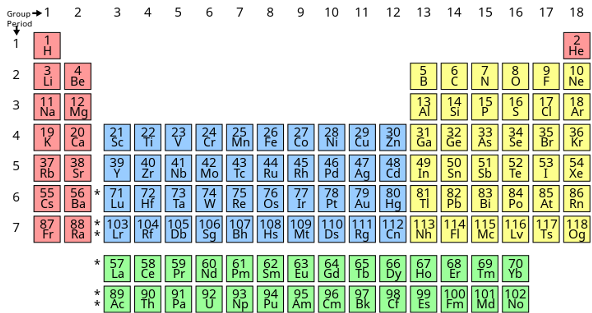

# Assignment-2 Questions & Solutions

💡 **Question-1:** What’s Box Model in CSS & Which CSS Properties are part of it ?

💬 **Solution-1:** 

The box model is a fundamental concept in CSS (Cascading Style Sheets) that describes how elements are rendered and displayed on a web page. It consists of several components that define the space occupied by an element, including its content, padding, border, and margin.

The CSS properties associated with the box model are:

  1.Content: The content area of an element, which is determined by properties like `width` and `height`.
    Padding: The space between the content and the border. Padding can be set using the `padding` property or its shorthand properties like `padding-top`, `padding-right`, `padding-bottom`, and `padding-left`.

  2.Border: The line that surrounds the content and padding. Borders can be set using the `border` 
    property or its shorthand properties like `border-width`, `border-style`, and `border-color`.

  3.Margin: The space outside the border, which separates the element from other elements. Margins can be 
    set using the `margin` property or its shorthand properties like `margin-top`, `margin-right`, `margin-bottom`, and `margin-left`.

<hr/>

💡 **Question-2:** What are the Different Types of Selectors in CSS & what are the advantages of them?

💬 **Solution-2:**

CSS selectors are used to target specific elements on a web page and apply styles to them. Here are some of the most commonly used types of selectors:

1. Element selectors: They target elements based on their tag name. For example, the selector `h1` 
targets all `<h1>` elements. Element selectors have a broad scope and can be useful for applying styles to multiple elements at once.

2. Class selectors: They target elements based on the value of their `class` attribute. Class selectors start with a dot (`.`) followed by the class name. For example, the selector `.my-class` targets all elements with the `class="my-class"` attribute. Class selectors are versatile and allow you to style specific groups of elements.

3. ID selectors: They target elements based on the value of their `id` attribute. ID selectors start with a hash (`#`) followed by the ID value. For example, the selector `#my-id` targets the element with `id="my-id"`. ID selectors have high specificity and should be unique within a page. They are useful for targeting specific individual elements.

4. Attribute selectors: They target elements based on the presence or value of their attributes. Attribute selectors are specified within square brackets (`[]`). For example, the selector `[type="text"]` targets all elements with `type="text"`. Attribute selectors are flexible and can be used to target elements with specific attribute values or to select elements with certain attributes.

5. Pseudo-class selectors: They target elements based on a particular state or condition. Pseudo-classes start with a colon (`:`). For example, the selector `:hover` targets an element when it is being hovered over by the mouse. Pseudo-class selectors are useful for creating interactive styles and applying styles to elements based on user interaction or element states.

6. Pseudo-element selectors: They target specific parts of an element, such as the first line or first letter of a block of text. Pseudo-elements also start with a colon (`:`), but with two colons (`::`). For example, the selector `::first-line` targets the first line of a block of text. Pseudo-element selectors allow you to style specific parts of an element's content.

<hr/>

💡 **Question-3:** What is VW/VH & How its different from PX?

💬 **Solution-3:**

VW (viewport width) and VH (viewport height) are units of measurement in CSS that allow you to specify sizes relative to the viewport dimensions. The viewport refers to the visible area of a web page in the browser window.

Here's how VW and VH differ from PX (pixels):

1. VW (Viewport Width): The VW unit represents a percentage of the viewport's width. For example, 1 VW is equal to 1% of the viewport width. So, if the viewport width is 1000 pixels, 1 VW is equivalent to 10 pixels. Using VW units allows you to create responsive designs that adapt to different screen sizes, as the element's size will be relative to the viewport width.

2. VH (Viewport Height): Similar to VW, VH represents a percentage of the viewport's height. For example, 1 VH is equal to 1% of the viewport height. If the viewport height is 800 pixels, 1 VH is equivalent to 8 pixels. VH units are useful for creating designs that adjust based on the height of the viewport.

3. PX (Pixels): PX is an absolute unit of measurement that represents a specific number of pixels on the screen. Unlike VW and VH, which are relative units, PX provides an exact size regardless of the viewport dimensions. For example, setting an element's width to 200 pixels will always make it 200 pixels wide, regardless of the screen size or viewport dimensions.

The main difference between VW/VH and PX is that VW and VH are relative units based on the viewport dimensions, while PX is an absolute unit based on a fixed pixel value.

<hr/>

💡 **Question-4:** Whats difference between Inline, Inline Block and block ?

💬 **Solution-4:**

The terms "inline," "inline-block," and "block" refer to the display property values in CSS, which determine how an element is rendered and how it interacts with other elements on the page. 

1. Inline: An inline element is displayed within the flow of text and does not start on a new line. Examples of inline elements include `<span>`, `<a>`, and `<em>`. Inline elements do not have any width or height properties, and their dimensions are determined by their content. They do not create line breaks and can appear alongside other inline elements. Additionally, you cannot set margins, paddings, or vertical alignment (top or bottom) on inline elements.

2. Inline Block: An inline-block element is similar to an inline element in that it flows within the text, but it can have a width, height, margins, paddings, and vertical alignment properties. It combines characteristics of both inline and block elements. Inline-block elements start on the same line as other inline or inline-block elements, but they can have block-level properties and be styled as boxes. Examples of inline-block elements include ``, `<button>`, and `<input>`. Inline-block elements can have a width and height defined, allowing them to have a specific size.

3. Block: A block-level element starts on a new line and takes up the full available width of its parent container. Examples of block-level elements include `<div>`, `<p>`, and `<h1>` to `<h6>`. Block-level elements create a "block" of content and, by default, have a width of 100% of their parent container. They can have width, height, margins, paddings, and vertical alignment properties. Block-level elements create line breaks before and after them, causing subsequent content to appear on new lines.

<hr/>

💡 **Question-5:** How is Border-box different from Content Box?

💬 **Solution-5:**

The terms "border-box" and "content-box" refer to different box-sizing values in CSS, which determine how the width and height of an element are calculated and how the padding and border affect the element's size.

1. Content Box (default): When an element has the box-sizing value set to "content-box," the width and height of the element are calculated based on the content area alone, excluding the padding and border.
This means that if you set a width of 300 pixels for an element with padding and a border, the actual width of the element will be wider than 300 pixels, as the padding and border will be added to the total width.


2. Border-box: When an element has the box-sizing value set to "border-box," the width and height of the element include the content area, padding, and border. In this model, the specified width and height of the element represent the total size, and the padding and border are included within that size. This ensures that the element's overall size remains constant, regardless of the padding and border values.
For example, setting a width of 300 pixels with padding and a border in the border-box model will result in the element fitting within that 300-pixel width, as the padding and border are deducted from the total width.

<hr/>


💡 **Question-6:**  What’s z-index and How does it Function ?

💬 **Solution-6:**

The z-index is a CSS property that controls the stacking order of positioned elements on a web page along the z-axis. It determines which elements appear in front of or behind other elements when they overlap in the two-dimensional plane.

The z-index property accepts an integer value, where a higher value indicates a higher stacking order. Elements with a higher z-index will appear in front of elements with a lower z-index. If two elements have the same z-index, their stacking order will be determined by their order in the HTML markup, with the element that appears later in the markup being positioned on top.

Here's how the z-index property functions:

1. Stacking Contexts: Each positioned element in a web page forms its own stacking context. A stacking context is a hierarchical structure in which elements are grouped and positioned relative to each other. The z-index property applies within each stacking context.

2. Parent-Child Relationship: The z-index property is relative to the parent-child relationship of elements. If a child element has a higher z-index than its parent, it may still appear behind other sibling elements that are outside of its parent.

3. Default Stacking Order: By default, all elements have a z-index of auto, which means they follow the natural stacking order based on their position in the HTML markup. Block-level elements are stacked in the order they appear in the markup, from top to bottom.

4. Stacking with Positioning: The z-index property only works on positioned elements, i.e., elements with a position value other than static (the default). Typically, you would set the position property to relative, absolute, or fixed to create a stacking context and apply z-index.

5. Stacking Order Hierarchy: The stacking order is influenced by different factors such as the stacking context, the z-index value, and the parent-child relationship. Higher z-index values move elements closer to the user and place them on top of elements with lower z-index values. However, this order only applies within the same stacking context.

Z-index property does not work on non-positioned (static) elements or elements with a CSS value of "fixed" that are removed from the normal document flow.

<hr/>


💡 **Question-7:** What’s Grid & Flex and difference between them?

💬 **Solution-7:**

Grid and Flexbox are two powerful layout systems in CSS that offer different approaches to creating responsive and flexible layouts.

1. Flexbox (Flexible Box Layout):
Flexbox is designed for one-dimensional layouts, primarily for arranging elements in a row or a column. It provides a flexible way to distribute space among elements within a container. Key features of Flexbox include:

- Main axis and cross axis: Flexbox introduces the concept of a main axis and a cross axis. You can specify the direction of the main axis as either horizontal (row) or vertical (column).

- Parent-child relationship: Flexbox operates on a parent-child relationship, where the container (parent) defines the layout behavior, and the child elements adjust accordingly.

- Flexible sizing: Flexbox allows you to control how child elements expand, shrink, or wrap based on available space.

- Alignment: Flexbox provides options for aligning items along the main axis and cross axis, allowing you to control their positioning within the container.

- One-dimensional layout: Flexbox is ideal for layouts that require elements to be organized in a single row or column, and it excels at distributing space among the items in that direction.


2. Grid Layout:
Grid Layout is designed for two-dimensional layouts, allowing you to create complex and grid-based designs. It divides a container into rows and columns and enables precise control over the placement and alignment of elements. Key features of Grid Layout include:

- Rows and columns: Grid Layout introduces the concept of defining explicit rows and columns to create a grid structure. You can specify the size, alignment, and distribution of these rows and columns.

- Parent-child relationship: Grid Layout operates on a parent-child relationship, where the container (parent) defines the grid structure, and the child elements are placed within the grid.

- Cell positioning: Grid Layout allows you to place items anywhere in the grid, specifying their start and end positions within specific grid cells.

- Automatic placement: Grid Layout also offers automatic placement, where items can be placed by the grid algorithm based on available space.

- Two-dimensional layout: Grid Layout excels at creating complex and multi-dimensional layouts where elements can span across multiple rows and columns, and precise control over their placement is required.

Major differences between Grid and Flexbox:

- Layout approach: Flexbox focuses on one-dimensional layouts (row or column), while Grid Layout is designed for two-dimensional layouts (rows and columns).

- Control: Flexbox provides control over the alignment and distribution of items along a single axis, while Grid Layout offers control over the placement and alignment of items within a grid structure.

- Grid structure: Grid Layout introduces a grid structure with explicit rows and columns, while Flexbox does not rely on a predefined grid.

- Complexity: Grid Layout is generally more complex and versatile, allowing for intricate and multi-dimensional layouts. Flexbox is simpler and more suitable for basic one-dimensional layouts.

- Support for older browsers: Flexbox has broader support among older browsers compared to Grid Layout, which has more limited support.

<hr/>

💡 **Question-8:** Difference between absolute and relative and sticky and fixed position explain with example.

💬 **Solution-8:**

1. Absolute Positioning:
An element with `position: absolute;` is positioned relative to its nearest positioned ancestor or to the initial containing block (the viewport if no positioned ancestor is found).
It is taken out of the normal document flow, meaning other elements will not be affected by its position.

Example:

```css
.parent {
  position: relative;
}

.absolute-element {
   position: absolute;
   top: 50px;
  left: 20px;
}
```

In this example, the `.absolute-element` will be positioned 50 pixels from the top and 20 pixels from the left of its nearest positioned ancestor (`.parent`).


2. Relative Positioning:
An element with `position: relative;` is positioned relative to its normal position in the document flow.
It does not affect the position of other elements, and they will be positioned as if the element were still in its normal position.

Example:

```css
.relative-element {
   position: relative;
   top: 10px;
   left: 20px;
}
```

In this example, the `.relative-element` will be positioned 10 pixels down and 20 pixels to the right of its normal position within the document flow.


3. Sticky Positioning:
An element with `position: sticky;` is positioned based on its scroll position within its containing block.
It acts as `relative` until a specified offset threshold is reached, after which it becomes `fixed` and remains in a fixed position.
Example:

```css
.sticky-element {
   position: sticky;
  top: 100px;
}
```

In this example, the `.sticky-element` will behave normally within the document flow until the user scrolls to a point where the element is 100 pixels from the top of the viewport. At that point, the element will become sticky and remain fixed at that position as the user continues scrolling.


4. Fixed Positioning:
An element with `position: fixed;` is positioned relative to the viewport, meaning it remains fixed at a specific position even when the page is scrolled.
It is taken out of the normal document flow, and other elements will not be affected by its position.

Example:

```css
.fixed-element {
 position: fixed;
   top: 20px;
  right: 30px;
}
```

In this example, the `.fixed-element` will remain fixed 20 pixels from the top and 30 pixels from the right of the viewport, regardless of scrolling.

So the main difference between sticky and fixed positioning is that sticky elements become fixed only when a specific scroll position is reached, while fixed elements are always fixed relative to the viewport. Relative and absolute positioning are used within the normal document flow and differ in how they calculate the element's position, either relative to its closest positioned ancestor (absolute) or its default position (relative).

<hr/>


💡 **Question-9:** Build Periodic Table as shown in the below image:




💬 **Solution-9:**

### [Answer-9-Periodic_Table-Github Code Link](https://github.com/ShubhamSingh03/Placement_Assignment-Ineuron/tree/main/CSS/answer-9-periodic_table)

<hr/>

💡 **Question-10:** Build Responsive Layout both desktop and mobile and Tablet, see below image for reference ?


💬 **Solution-10:**

### [Answer-10-Responsive_Layout-Github Code Link](https://github.com/ShubhamSingh03/Placement_Assignment-Ineuron/tree/main/CSS/answer-11-responsive_layout)

<hr/>