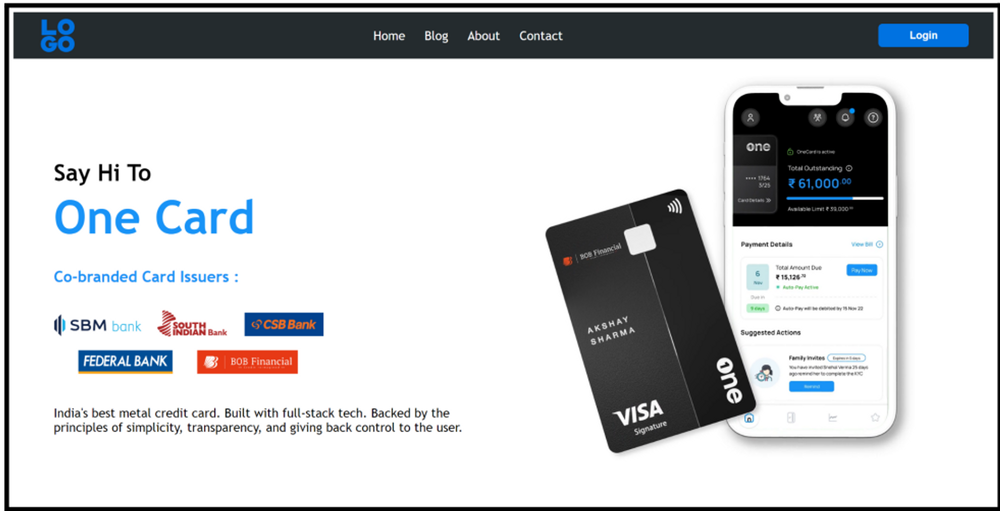

# Assignment-3 Questions & Solutions

💡 **Question-1:**  What is a Media Query in CSS, and what is its purpose?

💬 **Solution-1:** 

A media query in CSS is a feature that allows to apply different styles or rules to a web page based on certain device characteristics, such as the screen size, device orientation, or the capabilities of the device. It enables responsive web design by adapting the layout and appearance of a web page to different screen sizes and devices.

The purpose of media queries is to create CSS rules that target specific devices or device characteristics and apply styles accordingly. By using media queries, we can customize the presentation of website to provide an optimal viewing experience across various devices, including desktops, laptops, tablets, and mobile phones.

Media queries are written using the `@media` rule in CSS.

Example:

```css
@media screen and (max-width: 600px) {
  /* CSS rules for screens with a maximum width of 600px */
  /* e.g., smartphones in portrait mode */
  body {
    background-color: lightblue;
  }
}
```

The above media query targets screens with a maximum width of 600 pixels (e.g., smartphones in portrait mode). In this case, the background color of the `body` element will be set to light blue for screens with a maximum width of 600 pixels.

By using media queries effectively, we can create responsive and adaptive designs that adjust and optimize the layout, typography, and other styles based on the user's device, providing a consistent and user-friendly experience across different screen sizes and devices.

<hr/>

💡 **Question-2:**  How do you define a media query in CSS?

💬 **Solution-2:** 

To define a media query in CSS, we use the `@media` rule followed by the desired condition or conditions. Here's the basic syntax for writing a media query:

```css
@media mediaType and (condition) {
  /* CSS rules to be applied when the condition is met */
}
```

- `@media`: This is the keyword that indicates the start of a media query.
- `mediaType`: It specifies the type of media to which the media query applies. The most common media types are `all`, `screen`, `print`, `speech`, etc. `all` is the default if no media type is specified. The `screen` media type is typically used for targeting devices with screens, such as computers, tablets, and mobile devices.
- `condition`: It represents the condition or set of conditions that determine when the CSS rules inside the media query should be applied. Conditions can include various features like screen width, height, aspect ratio, device orientation, resolution, and more. Multiple conditions can be combined using logical operators like `and` and `or`.

In the example below, the media query targets screens with a `screen` media type and a maximum width of `600px`. The CSS rules inside the media query block will be applied when this condition is met.

```css
@media screen and (max-width: 600px) {
  /* CSS rules for screens with a maximum width of 600px */
}
```

<hr/>

💡 **Question-3:**  Explain the concept of Breakpoints in Responsive Web Design and How They are used in Media Queries.

💬 **Solution-3:** 

In responsive web design, breakpoints are specific screen widths at which the layout and design of a website are adjusted to provide an optimal viewing experience. Breakpoints define the points at which the content and design of a web page need to adapt to different screen sizes and device capabilities.

Media queries play a crucial role in implementing responsive web design, and breakpoints are used within media queries to target specific ranges of screen widths. By using breakpoints in media queries, we can apply different CSS styles and layout adjustments to accommodate different devices and screen sizes.

Here's how breakpoints and media queries work together:

1. Determine Breakpoints:
   - The first step in implementing responsive web design is to determine the breakpoints at which our website's layout needs to change.
   - Breakpoints are typically chosen based on common screen sizes or device categories, such as mobile phones, tablets, and desktops.
   - Commonly used breakpoints are often associated with specific screen widths, such as 320px, 480px, 768px, 1024px, and 1200px.

2. Define Media Queries:
   - Once we have determined the breakpoints, we can create media queries in CSS to target specific screen widths and apply appropriate styles.
   - Media queries allow to specify different CSS rules based on the screen width or other conditions using the `@media` rule.
   - Each media query typically includes a condition that checks if the screen width is within a specific range or matches a particular device characteristic.
   - The CSS rules inside the media query block will be applied only when the condition is met.

3. Apply Responsive Styles:
   - Within each media query, we can write CSS rules that adapt the layout, positioning, typography, and other styles to optimize the presentation for the targeted screen size or device.
   - By applying responsive styles at different breakpoints, we can ensure that our website displays correctly and provides an optimal user experience on a variety of devices.

Example:

```css
/* Mobile styles */
@media screen and (max-width: 480px) {
  /* CSS rules for screens up to 480px */
}

/* Tablet styles */
@media screen and (min-width: 481px) and (max-width: 768px) {
  /* CSS rules for screens between 481px and 768px */
}

/* Desktop styles */
@media screen and (min-width: 769px) {
  /* CSS rules for screens above 769px */
}
```

These three media queries are defined with breakpoints at 480px, 768px, and 769px. Each media query targets a specific range of screen widths and applies different CSS rules accordingly.

<hr/>

💡 **Question-4:**  What is the purpose of using Media Queries for Print Media?

💬 **Solution-4:** 

The purpose of using media queries for print media is to apply specific styles and formatting when a web page is printed or viewed in print preview mode. Media queries for print allows to optimize the appearance of content when it is intended to be printed on paper or saved as a PDF.

Here are some reasons and use cases for using media queries for print media:

1. Print-specific Layout and Styling:
   - When a web page is printed, it often requires a different layout and styling compared to its on-screen presentation.
   - Media queries for print allows to define specific CSS rules that are only applied when the content is printed.

2. Hide Unnecessary Elements:
   - Certain elements, such as navigation menus, ads, or interactive features, may not be relevant or useful in a printed document.
   - Media queries for print enables to selectively hide or display elements based on their relevance to the printed output.

3. Adjust Typography and Page Formatting:
   - Printed materials often require specific typography adjustments, such as larger font sizes, different font families, or increased line spacing for readability.
   - Media queries for print allow us to modify typography-related CSS properties to optimize the text appearance on paper.

4. Custom Page Headers and Footers:
   - Media queries for print enables to define custom headers and footers that appear on every printed page.
   - This allows to include useful information such as page numbers, document title, date, or copyright information in the printed output.

Example:

```css
@media print {
  /* Print-specific styles */
  body {
    font-size: 14pt;
    line-height: 1.5;
  }

  nav, .advertisements {
    display: none;
  }

  h1 {
    page-break-after: avoid;
  }

  @page {
    margin: 2cm;
  }
}
```

Above media query targeting `print` is used to define print-specific styles. The `body` font size and line height are adjusted for better readability in print. The `nav` element and elements with the class `.advertisements` are hidden in the printed output. The `h1` headings avoid page breaks to prevent splitting across pages. The `@page` rule sets a 2cm margin for the printed pages.

<hr/>

💡 **Question-5:** What is the purpose of the orientation media feature?

💬 **Solution-5:** 

The purpose of the orientation media feature in CSS is to target and apply specific styles based on the orientation of the device's viewport. The orientation media feature allows to detect whether the device is in a portrait or landscape orientation and apply different CSS rules accordingly.

The orientation media feature is particularly useful for adjusting the layout and styling of a web page based on the device's orientation. By utilizing this feature one can optimize the presentation of content and ensure a better user experience on different devices.

The orientation media feature can have two possible values:

1. `portrait`: This value indicates that the device's viewport is taller than it is wide. It is commonly associated with vertical orientation.

2. `landscape`: This value indicates that the device's viewport is wider than it is tall. It is commonly associated with horizontal orientation.

Example:

```css
@media (orientation: landscape) {
  /* CSS rules for landscape orientation */
  /* e.g., adjust layout, positioning, or font sizes for horizontal view */
  body {
    background-color: lightblue;
  }
}
```

Defined media query targets devices with a `landscape` orientation and applies specific CSS rules inside the media query block. In this case, the background color of the `body` element is set to light blue when the device is in a landscape orientation.

<hr/>

💡 **Question-6:** Imagine you are a web developer working for a creative agency that specializes in building visually appealing and interactive websites. The agency has recently received a client request to create a landing page similar to the design of the one-page website: https://www.getonecard.app/. The client wants to showcase a video prominently on the page to engage visitors.

Your task is to create a simple webpage that replicates the one-page landing page design, including a responsive layout and an HTML video. The below images are for your reference. Some browsers don’t allow you to play videos without the controls attribute. So, you can add controls here, we will learn how to play a video without the controls attribute in the later sections.

💬 **Solution-6:** 



**HTML**

```html
<!DOCTYPE html>
<html lang="en">
<head>
  <meta charset="UTF-8">
  <meta name="viewport" content="width=device-width, initial-scale=1.0">
  <title>OneCard Landing Page</title>
  <link rel="stylesheet" href="styles.css">
</head>
<body>
  <header>
    <nav>
      <ul>
        <li><a href="#features">Features</a></li>
        <li><a href="#how-it-works">How It Works</a></li>
        <li><a href="#pricing">Pricing</a></li>
        <li><a href="#contact">Contact</a></li>
      </ul>
    </nav>
  </header>

  <section class="hero">
    <div class="video-container">
      <video src="video.mp4" autoplay loop muted controls></video>
    </div>
  </section>

  <section id="features">
    <!-- Features content goes here -->
  </section>

  <section id="how-it-works">
    <!-- How It Works content goes here -->
  </section>
</body>
</html>
```

**CSS**

```css
* {
  box-sizing: border-box;
  margin: 0;
  padding: 0;
}

body {
  font-family: Arial, sans-serif;
}

header {
  background-color: #333;
  color: #fff;
  padding: 20px;
}

nav ul {
  list-style: none;
}

nav ul li {
  display: inline;
  margin-right: 10px;
}

nav ul li a {
  color: #fff;
  text-decoration: none;
}

/* Hero section styles */
.hero {
  height: 100vh;
}

.video-container {
  position: relative;
  overflow: hidden;
  width: 100%;
  height: 100%;
}

.video-container video {
  width: 100%;
  height: 100%;
  object-fit: cover;
}

section {
  padding: 100px 20px;
}

@media (max-width: 600px) {
  header {
    text-align: center;
  }

  nav ul {
    display: flex;
    flex-wrap: wrap;
    justify-content: center;
  }

  nav ul li {
    margin: 10px;
  }
}
```

<hr/>

💡 **Question-7:**  You are tasked with building a webpage that displays an image gallery using a grid layout. The challenge is to ensure the gallery is visually appealing and functional on both large and small screens. On large screens, the gallery should display multiple images per row, while on small screens, it should collapse into a single column for optimal viewing. Refer to the attached images for visual reference. Implement this using CSS Grid and media queries for responsiveness.

💬 **Solution-7:** 

**HTML**

```html
<!DOCTYPE html>
<html>
<body>
<div class="gallery">
  <div class="gallery-item">
    
  </div>
  <div class="gallery-item">
    
  </div>
  <div class="gallery-item">
    
  </div>
  <div class="gallery-item">
    
  </div>
  <div class="gallery-item">
    
  </div>
  <div class="gallery-item">
    
  </div>
</div>
</body>
</html>
```

**CSS**

```css
.gallery {
  display: grid;
  grid-template-columns: repeat(auto-fit, minmax(200px, 1fr));
  grid-gap: 20px;
}

.gallery-item img {
  width: 100%;
  height: 200px;
  border-radius: 10px;
}

/* Responsive styles */
@media (max-width: 600px) {
  .gallery {
    grid-template-columns: 1fr;
  }
}
```
**Larger Screens:**


**Smaller Screens:**


<hr/>

💡 **Question-8:** In this coding challenge, your task is to create an information section for the previously built OneCard webpage clone, focusing on the different modes like dark and light modes. The webpage should look different depending on the screen size: dark mode for larger screens and light mode for smaller devices.

💬 **Solution-8:** 

**HTML**

```html
<section class="information">
  <div class="container">
    <h2>No Hidden Fees Ever</h2>
    <p>No Joining Fees</p>
    <p>No Annual Fees</p>
  </div>
</section>
```

**CSS**

```css
.information {
  padding: 100px 0;
}

.container {
  max-width: 800px;
  margin: 0 auto;
  text-align: center;
}

h2 {
  font-size: 32px;
  margin-bottom: 20px;
}

p {
  font-size: 18px;
}

/* Dark mode styles for larger screens */
@media (min-width: 600px) {
  body {
    background-color: #222;
    color: #fff;
  }

  .information {
    background-color: #333;
  }

  h2 {
    color: #fff;
  }

  p {
    color: #ccc;
  }
}

/* Light mode styles for smaller screens */
@media (max-width: 599px) {
  body {
    background-color: #f5f5f5;
    color: #333;
  }

  .information {
    background-color: #fff;
  }
}
```
<hr/>


💡 **Question-10:** You have been given to create a student dashboard page that includes a student details table. The challenge lies in handling the table's display on different screen sizes. On large screens, the table should be fully visible, while on small screens, it should have an internal scroll to ensure proper visibility of information. Refer to the attached images for visual reference.

💬 **Solution-10:** 


**HTML**

```html
<div class="dashboard">
  <table class="student-table">
    <thead>
      <tr>
        <th>Name</th>
        <th>Email</th>
        <th>Phone No.</th>
      </tr>
    </thead>
    <tbody>
      <tr><td>Rahul Sharma</td> <td>rahul.sharma@example.com</td> <td>1234567890</td></tr>
      <tr><td>Vivek Bindra</td> <td>vivek.bindra@example.com</td> <td>3432323890</td></tr>
      <tr><td>Prita Patel</td> <td>prita.patel@example.com</td> <td>4348234984</td></tr>
      <tr><td>Amit Saini</td> <td>amit.saini@example.com</td> <td>9852985222</td></tr>
      <tr><td>Rahul Sharma</td> <td>rahul.sharma@example.com</td> <td>5482520852</td></tr>
      <tr><td>Anita Desai</td> <td>anita.desai@example.com</td> <td>2343244884</td></tr>
    </tbody>
  </table>
</div>

```

**CSS**

```css
.dashboard {
  padding: 20px;
}

.student-table {
  width: 100%;
  border-collapse: collapse;
}

.student-table th,
.student-table td {
  padding: 10px;
  text-align: left;
  border-bottom: 1px solid #ddd;
}

.student-table th {
  background-color: #f2f2f2;
}

/* Responsive styles */
@media (max-width: 600px) {
  .student-table {
    overflow-x: auto;
    display: block;
  }

  .student-table thead,
  .student-table tbody,
  .student-table th,
  .student-table td,
  .student-table tr {
    display: block;
  }

  .student-table thead tr {
    position: absolute;
    top: -9999px;
    left: -9999px;
  }

  .student-table tbody tr {
    border: 1px solid #ddd;
  }

  .student-table td {
    border: none;
    border-bottom: 1px solid #ddd;
    position: relative;
    padding-left: 50%;
  }

  .student-table td:before {
    position: absolute;
    top: 6px;
    left: 6px;
    width: 45%;
    padding-right: 10px;
    white-space: nowrap;
    font-weight: bold;
  }

  .student-table td:nth-of-type(1):before {
    content: "Name";
  }

  .student-table td:nth-of-type(2):before {
    content: "Email";
  }

  .student-table td:nth-of-type(3):before {
    content: "Phone No.";
  }
}
```

<hr/>