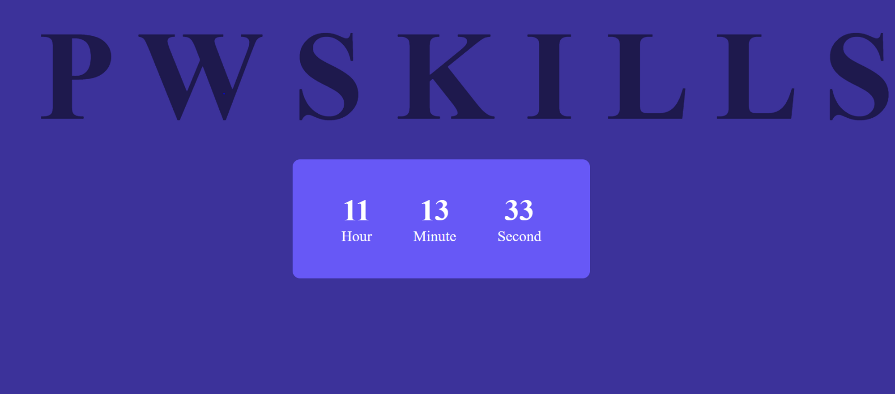

# Assignment-7 Questions & Solutions

💡 **Question-1:** Create an elegant and functional digital clock using HTML, CSS, and JavaScript, where the current time is displayed with precision.

💬 **Solution-1:** 

**HTML**

```html
<!DOCTYPE html>
<html>
<head>
  <title>Digital Clock</title>
  <link rel="stylesheet" type="text/css" href="style.css">
</head>
<body>
  <h1>PW SKILLS</h1>
  <div class="clock">
    <div class="time" id="time"></div>
  </div>

  <script src="script.js" type="module"></script>
</body>
</html>
```

**CSS**

```css
.clock {
  display: flex;
  justify-content: center;
  align-items: center;
  height: 100vh;
  font-family: Arial, sans-serif;
  font-size: 5rem;
}

.time {
  background-color: #f8f8f8;
  padding: 1rem 2rem;
  border-radius: 0.5rem;
  box-shadow: 0 2px 6px rgba(0, 0, 0, 0.1);
}
```

**JS**

```js
const updateTime = () => {
  const now = new Date();
  const hours = now.getHours().toString().padStart(2, "0");
  const minutes = now.getMinutes().toString().padStart(2, "0");
  const seconds = now.getSeconds().toString().padStart(2, "0");

  const timeString = `${hours}:${minutes}:${seconds}`;

  document.getElementById("time").textContent = timeString;
};

setInterval(updateTime, 1000);
```



<hr/>

💡 **Question-2:** Develop a **GitHub User Finder** web application using **HTML**, **CSS**, and **JavaScript**. The application should allow users to enter a **GitHub username** and display relevant information about the user, including their avatar and name. The design of the application should follow the layout provided in the image below.

- Use Github Api to get User Data “https://api.github.com/users”

💬 **Solution-2:** 

**HTML**

```html
<!DOCTYPE html>
<html>
<head>
  <link rel="stylesheet" type="text/css" href="style.css">
</head>
<body>
  <div class="container">
    <h1>GitHub User Finder</h1>
    <input type="text" id="username" placeholder="Enter GitHub username">
    <button onclick="getUserData()">Search</button>
    <div id="user-info" class="hidden">
      
      <h2 id="name"></h2>
    </div>
  </div>

  <script src="script.js"></script>
</body>
</html>
```

**CSS**

```css
.container {
  display: flex;
  flex-direction: column;
  align-items: center;
  margin-top: 100px;
}

h1 {
  font-size: 24px;
  margin-bottom: 20px;
}

input {
  width: 200px;
  height: 30px;
  padding: 5px;
  margin-bottom: 10px;
}

button {
  width: 100px;
  height: 30px;
  background-color: #007bff;
  color: #fff;
  border: none;
  cursor: pointer;
}

#user-info {
  display: flex;
  flex-direction: column;
  align-items: center;
  margin-top: 20px;
}

#avatar {
  width: 150px;
  height: 150px;
  border-radius: 50%;
  margin-bottom: 10px;
}

.hidden {
  display: none;
}
```

**JS**

```js
function getUserData() {
  const username = document.getElementById("username").value;

  fetch(`https://api.github.com/users/${username}`)
    .then(response => response.json())
    .then(data => {
      if (data.message === "Not Found") {
        alert("User not found");
      } else {
        showUserData(data);
      }
    })
    .catch(error => {
      console.error(error);
      alert("An error occurred while fetching user data");
    });
}

function showUserData(user) {
  const avatar = document.getElementById("avatar");
  const name = document.getElementById("name");
  const userInfo = document.getElementById("user-info");

  avatar.src = user.avatar_url;
  name.textContent = user.name;

  userInfo.classList.remove("hidden");
}
```

<hr/>

💡 **Question-3:** Develop a live preview project using HTML, CSS, and JavaScript, consisting of two sections: a form section and a live preview section. The live preview section should dynamically display the information filled in the form section in real time.

💬 **Solution-3:** 

**HTML**

```html
<!DOCTYPE html>
<html>
<head>
  <link rel="stylesheet" type="text/css" href="style.css">
</head>
<body>
  <div class="container">
    <div class="form-section">
      <h2>Form Section</h2>
      <input type="text" id="name" placeholder="Enter your name">
      <input type="email" id="email" placeholder="Enter your email">
      <textarea id="message" placeholder="Enter your message"></textarea>
    </div>

    <div class="preview-section">
      <h2>Live Preview</h2>
      <div id="preview-name"></div>
      <div id="preview-email"></div>
      <div id="preview-message"></div>
    </div>
  </div>

  <script src="script.js"></script>
</body>
</html>
```

**CSS**

```css
.container {
  display: flex;
  justify-content: center;
  align-items: center;
  height: 100vh;
}

.form-section, .preview-section {
  padding: 20px;
  border: 1px solid #ccc;
  border-radius: 5px;
}

.form-section {
  margin-right: 20px;
}

h2 {
  margin-top: 0;
}

input[type="text"], input[type="email"], textarea {
  width: 100%;
  padding: 5px;
  margin-bottom: 10px;
}

.preview-section div {
  margin-bottom: 10px;
}
```

**JS**

```js
const nameInput = document.getElementById("name");
const emailInput = document.getElementById("email");
const messageInput = document.getElementById("message");

const previewName = document.getElementById("preview-name");
const previewEmail = document.getElementById("preview-email");
const previewMessage = document.getElementById("preview-message");

nameInput.addEventListener("input", updatePreview);
emailInput.addEventListener("input", updatePreview);
messageInput.addEventListener("input", updatePreview);

function updatePreview() {
  previewName.textContent = nameInput.value;
  previewEmail.textContent = emailInput.value;
  previewMessage.textContent = messageInput.value;
}
```

<hr/>

💡 **Question-4:** Create a Simple Todo Web App with following features :

- An input button where users can type their tasks.
- On clicking the submit button, the entered task should be displayed in the UI.
- The UI layout should resemble the image provided.

💬 **Solution-4:** 

**HTML**

```html
<!DOCTYPE html>
<html>
<head>
  <link rel="stylesheet" type="text/css" href="styles.css">
</head>
<body>
  <div class="container">
    <h1>Todo List</h1>
    <form id="todo-form">
      <input type="text" id="task-input" placeholder="Enter a task">
      <button type="submit">Add Task</button>
    </form>
    <div id="task-list"></div>
  </div>

  <script src="app.js"></script>
</body>
</html>
```

**CSS**

```css
.container {
  max-width: 600px;
  margin: 0 auto;
  padding: 20px;
}

h1 {
  text-align: center;
}

form {
  display: flex;
  margin-bottom: 20px;
}

input[type="text"] {
  flex: 1;
  padding: 8px;
}

button {
  padding: 8px 16px;
  background-color: #4CAF50;
  color: white;
  border: none;
  cursor: pointer;
  transition: background-color 0.3s ease;
}

button:hover {
  background-color: #45a049;
}

#task-list {
  display: flex;
  flex-wrap: wrap;
  justify-content: space-between;
}

.task {
  width: 30%;
  margin-bottom: 20px;
  border: 1px solid #ddd;
  padding: 10px;
}

.task h3 {
  margin: 0;
}

.task p {
  margin-top: 5px;
  margin-bottom: 10px;
}

.task .btn {
  margin-right: 5px;
  padding: 6px 10px;
  background-color: #808080;
  color: white;
  border: none;
  cursor: pointer;
  transition: background-color 0.3s ease;
}

.task .btn:hover {
  background-color: #555555;
}
```

**JS**

```js
document.addEventListener('DOMContentLoaded', function() {
  const form = document.getElementById('todo-form');
  const taskInput = document.getElementById('task-input');
  const taskList = document.getElementById('task-list');

  form.addEventListener('submit', function(event) {
    event.preventDefault();
    const task = taskInput.value.trim();
    if (task !== '') {
      createTask(task);
      taskInput.value = '';
    }
  });

  function createTask(task) {
    const taskDiv = document.createElement('div');
    taskDiv.classList.add('task');
    const taskHeading = document.createElement('h3');
    taskHeading.textContent = task;
    const taskStatus = document.createElement('p');
    taskStatus.textContent = 'Status: pending';
    const updateBtn = document.createElement('button');
    updateBtn.classList.add('btn');
    updateBtn.textContent = 'Update Status';
    const deleteBtn = document.createElement('button');
    deleteBtn.classList.add('btn');
    deleteBtn.textContent = 'Delete';

    taskDiv.appendChild(taskHeading);
    taskDiv.appendChild(taskStatus);
    taskDiv.appendChild(updateBtn);
    taskDiv.appendChild(deleteBtn);
    taskList.appendChild(taskDiv);
  }
});
```

<hr/>

💡 **Question-5:** Expand the existing todo web app with two additional functionalities:

1. On clicking the "Update Status" button:
    - Update the status of the task.
    - Change the background color of the task to indicate the updated status.
2. On clicking the "Delete Todo" button:
    - Remove the selected todo from the UI.
    - Ensure that the deleted todo is no longer visible in the todo list.


💬 **Solution-5:** 

**JS**

```js
document.addEventListener('DOMContentLoaded', function() {

  // same as above....

  // two new functionalities
  function updateStatus(taskDiv) {
    const taskStatus = taskDiv.querySelector('p');
    taskStatus.textContent = 'Status: completed';
    taskDiv.classList.add('completed');
  }

  function deleteTask(taskDiv) {
    taskDiv.remove();
  }
});
```

<hr/>

💡 **Question-6:** Add Edit Functionality to the Todo Web App

On clicking the "**Edit**" button for a specific todo:

- Display a Form where the user can update the data of the selected todo.
- Provide input fields or text areas in the modal to edit the todo's details.
- On clicking the "Update" button in the modal:
    - Update the data of the todo with the user's changes.
    - Ensure that the updated data is immediately visible in the UI, reflecting the changes made by the user.

💬 **Solution-6:** 

**HTML**

```html
<!DOCTYPE html>
<html>
<head>
  <link rel="stylesheet" type="text/css" href="styles.css">
</head>
<body>
  <div class="container">
    <h1>Todo List</h1>
    <form id="todo-form">
      <input type="text" id="task-input" placeholder="Enter a task">
      <button type="submit">Add Task</button>
    </form>
    <div id="task-list"></div>

    <!-- Edit Modal -->
    <div id="edit-modal" class="modal">
      <div class="modal-content">
        <span class="close">&times;</span>
        <h2>Edit Todo</h2>
        <form id="edit-form">
          <input type="text" id="edit-task-input" placeholder="Enter a task">
          <button type="submit">Update</button>
        </form>
      </div>
    </div>
  </div>

  <script src="app.js"></script>
</body>
</html>
```

**CSS**

```css
.container {
  max-width: 600px;
  margin: 0 auto;
  padding: 20px;
}

h1 {
  text-align: center;
}

form {
  display: flex;
  margin-bottom: 20px;
}

input[type="text"] {
  flex: 1;
  padding: 8px;
}

button {
  padding: 8px 16px;
  background-color: #4CAF50;
  color: white;
  border: none;
  cursor: pointer;
  transition: background-color 0.3s ease;
}

button:hover {
  background-color: #45a049;
}

#task-list {
  display: flex;
  flex-wrap: wrap;
  justify-content: space-between;
}

.task {
  width: 30%;
  margin-bottom: 20px;
  border: 1px solid #ddd;
  padding: 10px;
  position: relative;
}

.task h3 {
  margin: 0;
}

.task p {
  margin-top: 5px;
  margin-bottom: 10px;
}

.task .btn {
  margin-right: 5px;
  padding: 6px 10px;
  background-color: #808080;
  color: white;
  border: none;
  cursor: pointer;
  transition: background-color 0.3s ease;
}

.task .btn:hover {
  background-color: #555555;
}

/* Edit Modal */
.modal {
  display: none;
  position: fixed;
  z-index: 1;
  left: 0;
  top: 0;
  width: 100%;
  height: 100%;
  overflow: auto;
  background-color: rgba(0, 0, 0, 0.4);
}

.modal-content {
  background-color: #fefefe;
  margin: 15% auto;
  padding: 20px;
  border: 1px solid #888;
  width: 50%;
}

.close {
  color: #aaa;
  float: right;
  font-size: 28px;
  font-weight: bold;
  cursor: pointer;
}

.close:hover,
.close:focus {
  color: #000;
  text-decoration: none;
  cursor: pointer;
}
```

**JS**

```js
document.addEventListener('DOMContentLoaded', function() {
  const form = document.getElementById('todo-form');
  const taskInput = document.getElementById('task-input');
  const taskList = document.getElementById('task-list');
  const editModal = document.getElementById('edit-modal');
  const editForm = document.getElementById('edit-form');
  const editTaskInput = document.getElementById('edit-task-input');
  const editModalClose = document.getElementsByClassName('close')[0];

  form.addEventListener('submit', function(event) {
    event.preventDefault();
    const task = taskInput.value.trim();
    if (task !== '') {
      createTask(task);
      taskInput.value = '';
    }
  });

  function createTask(task) {
    const taskDiv = document.createElement('div');
    taskDiv.classList.add('task');
    const taskHeading = document.createElement('h3');
    taskHeading.textContent = task;
    const taskStatus = document.createElement('p');
    taskStatus.textContent = 'Status: pending';
    const updateBtn = document.createElement('button');
    updateBtn.classList.add('btn');
    updateBtn.textContent = 'Update Status';
    const editBtn = document.createElement('button');
    editBtn.classList.add('btn');
    editBtn.textContent = 'Edit';
    const deleteBtn = document.createElement('button');
    deleteBtn.classList.add('btn', 'btn-delete');
    deleteBtn.textContent = 'Delete';

    updateBtn.addEventListener('click', function() {
      updateStatus(taskDiv);
    });

    editBtn.addEventListener('click', function() {
      openEditModal(taskDiv, taskHeading.textContent);
    });

    deleteBtn.addEventListener('click', function() {
      deleteTask(taskDiv);
    });

    taskDiv.appendChild(taskHeading);
    taskDiv.appendChild(taskStatus);
    taskDiv.appendChild(updateBtn);
    taskDiv.appendChild(editBtn);
    taskDiv.appendChild(deleteBtn);
    taskList.appendChild(taskDiv);
  }

  function updateStatus(taskDiv) {
    const taskStatus = taskDiv.querySelector('p');
    taskStatus.textContent = 'Status: completed';
    taskDiv.classList.add('completed');
  }

  function deleteTask(taskDiv) {
    taskDiv.remove();
  }

  function openEditModal(taskDiv, currentTask) {
    editTaskInput.value = currentTask;
    editModal.style.display = 'block';

    editModalClose.addEventListener('click', closeEditModal);

    editForm.addEventListener('submit', function(event) {
      event.preventDefault();
      const updatedTask = editTaskInput.value.trim();
      if (updatedTask !== '') {
        updateTask(taskDiv, updatedTask);
        closeEditModal();
      }
    });
  }

  function updateTask(taskDiv, updatedTask) {
    const taskHeading = taskDiv.querySelector('h3');
    taskHeading.textContent = updatedTask;
  }

  function closeEditModal() {
    editModal.style.display = 'none';
    editModalClose.removeEventListener('click', closeEditModal);
    editForm.reset();
  }
});
```

<hr/>